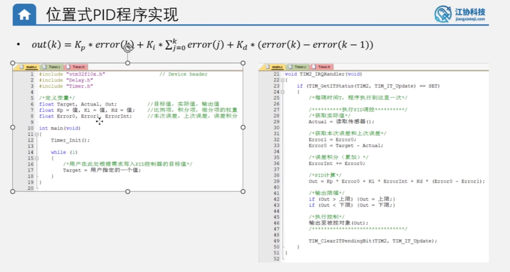
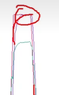
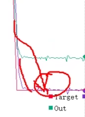

# 关于项目 PWM 控制与编码器测速的问题解答

## 问题 1：项目中 PWM 的大小用于控制电机的转速与方向是吗？PWM 的绝对值越大，电机的速度越大吗？

### 答案：
**是的，完全正确。**

在 [Motor.c](file:///E:/Project/PID_Study/02-%E4%BD%8D%E7%BD%AE%E5%BC%8FPID%E5%AE%9A%E9%80%9F%E6%8E%A7%E5%88%B6/Hardware/Motor.c) 中，控制逻辑如下：
1. **方向控制**：
   - `PWM` 设定值的**正负号**决定了电机的旋转方向。
   - 当 `PWM >= 0` 时，控制引脚 PB12 输出低电平，PB13 输出高电平，电机**正转**。
   - 当 `PWM < 0` 时，控制引脚 PB12 输出高电平，PB13 输出低电平，电机**反转**。
2. **转速控制**：
   - `PWM` 的**绝对值**（范围 `0 ~ 100`）决定了占空比。
   - 绝对值越大，输出到电机两端的平均电压越高，电机的**转速就越大**。

---

## 问题 2：编码器速度 Speed 的单位是什么？它是如何得到的？

### 答案：

1. **当前 Speed 的单位**：
   - 当前的 `Speed` 单位是 **脉冲数/40毫秒**（即每 40ms 测得的脉冲计数增量）。
   - 它是一个无量纲的计数值，直接反映了速度的大小，但并不是标准的物理单位。
   - **如果想转换为标准单位（转/秒，即 r/s）**，公式为：
     $$\text{转每秒(r/s)} = \frac{\text{Speed}}{408.0 \times 0.04}$$
     *(其中 408 是电机旋转一圈对应的编码器计数变化量，0.04 是 40ms 测量周期对应的秒数。)*

2. **如何得到的（测速原理）**：
   - **硬件计数**：在 [Encoder.c](file:///E:/Project/PID_Study/02-%E4%BD%8D%E7%BD%AE%E5%BC%8FPID%E5%AE%9A%E9%80%9F%E6%8E%A7%E5%88%B6/Hardware/Encoder.c) 中，单片机的定时器 `TIM3` 被配置为**编码器接口模式**。它会根据编码器输出的 A、B 两相信号进行双相计数（4倍频），自动增加或减少计数器 `CNT` 的值。
   - **软件定时采样（M法测速）**：在 [main.c](file:///E:/Project/PID_Study/02-%E4%BD%8D%E7%BD%AE%E5%BC%8FPID%E5%AE%9A%E9%80%9F%E6%8E%A7%E5%88%B6/User/main.c) 的定时中断服务函数 `TIM1_UP_IRQHandler` 中，系统每隔 1ms 产生一次中断。通过计数变量进行 40 次分频，即**每 40ms** 调用一次 `Encoder_Get()` 函数。
   - **数据获取与清零**：在 `Encoder_Get()` 函数中，会读取当前 `TIM3` 的计数器值，读取完后**立即将计数器清零**。这样，每次读取到的值就是这 40ms 时间内编码器产生的脉冲变化量（增量值），该值即为当前速度 `Speed`。

---

## 问题 3：为什么编码器读取的周期越长，测速的精度越高？

### 答案：

这是由**数字采样中的计数误差（量化误差）**决定的。我们可以从以下两个方面来通俗地理解：

1. **“误差占比”的数学原理**：
   - 编码器测速采用的是**M法（测频法）**，即“在固定时间内数脉冲个数”。
   - 在数字系统中，计数值只能是整数（例如 10 个脉冲，不能是 10.5 个）。因为读取时刻和脉冲到来的时刻很难完全同步，在采样周期的边界处，总是会产生最大 **$\pm 1$ 个脉冲的计数误差**（称为边界量化误差）。
   - **如果读取周期很短**（比如 5ms）：
     - 假设电机在此期间只产生了 5 个脉冲。
     - 若发生 $+1$ 个脉冲的误差（数成了 6 个），**相对误差**高达：
       $$\frac{1}{5} = 20\%$$
       这会导致测出来的速度产生剧烈的波动，精度极低。
   - **如果读取周期较长**（比如 40ms）：
     - 相同的电机转速下，由于时间变长了 8 倍，这段时间内积累的脉冲数也会变多，假设达到了 40 个脉冲。
     - 此时即使同样发生 $\pm 1$ 个脉冲的误差（数成了 41 个），**相对误差**就会降低到：
       $$\frac{1}{40} = 2.5\%$$
       因此，读取周期越长，单次采样积累的脉冲基数越大，$\pm 1$ 脉冲误差所占的比例就越小，测速的精度和稳定性就越高。

2. **工程上的“精度”与“延迟”折中**：
   - **周期越长**：测速越准，速度波形越平滑，但在闭环控制（如 PID 控制）中会引入**信号延迟**。如果延迟太大，控制器不能及时感知电机速度的变化，可能导致控制系统失稳甚至产生震荡。
   - **周期越短**：虽然反应灵敏（实时性好），但是测得的速度波动很大，特别是在低速运行时，可能出现测速值为 0 或突变为 1 的情况。
   - 因此，**40ms 左右**通常是电机定速控制中在“测速精度”和“系统实时性”之间折中的一个经典选择。

---

## 问题 4：为什么 PID 的调控周期最好和编码器读取周期保持一致？不能一方离另外一方差距较远吗？

### 答案：

在闭环控制系统中，**控制器的计算（PID）**和**传感器的反馈（编码器）**需要步调一致。如果两者周期差距较远，会导致系统出现严重的控制问题。我们可以分两种情况来拆解：

### 情况 1：PID 计算周期远小于编码器读取周期（PID 算得太快，编码器更新太慢）
* **现象举例**：编码器每 **40ms** 才更新一次速度，但 PID 算法每 **1ms** 就计算并调整一次 PWM。
* **后果**：**系统容易产生剧烈震荡，控制失效。**
* **原因拆解**：
  1. 在第 1ms 时，PID 读取速度并输出了一次 PWM。
  2. 在第 2ms 到第 39ms 期间，编码器还没有到更新时间，因此 PID 每次读取到的“当前速度”都是 40ms 前的**旧数据**。
  3. 控制器会产生误判：“我都连续调整了几十次 PWM 了，为什么速度一点变化都没有？”。
  4. 于是，PID 的**比例（P）项**和**积分（I）项**会继续疯狂累加调控力度，强行把 PWM 推向极限。
  5. 到了第 40ms，编码器终于更新了速度，此时由于之前的过度调整，电机的真实速度早已严重超速。PID 发现后又开始拼命朝反方向狂拉 PWM，导致电机忽快忽慢，剧烈抖动。

---

### 情况 2：PID 计算周期远大于编码器读取周期（PID 算得太慢，编码器更新太快）
* **现象举例**：编码器每 **5ms** 就获取一次新速度，但 PID 算法每 **100ms** 才计算并更新一次 PWM。
* **后果**：**系统响应极其迟钝，失去了闭环控制的意义。**
* **原因拆解**：
  1. 编码器虽然高频测出了速度的微小变化，但 PID 根本不予理睬，中间 95ms 的数据全部被“浪费”掉了。
  2. 当电机受到外界阻力导致速度突降时，系统必须死等到 100ms 的时刻到来才会做出微弱的调整，反应极其缓慢，无法起到稳定速度的作用。

---

### 最佳实践总结：
**“获取一次新反馈，就进行一次新决策”。**
在定时中断中，**每当编码器完成一次测速并得到最新速度数据时，立刻调用 PID 算法更新一次 PWM 输出**。这种“一一对应”的步调：
1. 保证了 PID 每次拿到的都是**最新的真实反馈**，避免了对旧数据的“重复微调”。
2. 保证了每次速度变化都能**在第一时间被补偿**，系统的响应速度和稳定性达到最佳平衡。

---

## 问题 5：Kp、Ki、Kd 的值为什么都是 0？要如何才能得到它们？

### 答案：

### 1. 为什么目前它们的值是 0？
在控制系统没有开始运行闭环算法前，所有的控制系数默认都会初始化为 0。
因为当前项目还处于**开环测试阶段**（只通过按键直接给电机设定 PWM），代码里还没有实现闭环 PID 算法。控制系数为 0 意味着 PID 控制器此时没有对电机输出任何调整作用。

### 2. 要如何才能得到（整定）这些参数值？
在实际开发中，这些参数并不是通过公式精确计算出来的，而是通过**“参数整定”**（即调试）实验得到的。对于电机定速控制，最常用、最实用的方法是**“系统试凑法”**。具体的整定步骤拆解如下：

#### 步骤一：先调节比例项 $K_p$（解决“能不能跟上”的问题）
1. 将积分系数 $K_i$ 和微分系数 $K_d$ 设为 0，先将 $K_p$ 设为一个很小的初始值（例如 0.5 或 1）。
2. 给电机一个目标速度，观察电机的实际响应。
3. 逐渐**增大** $K_p$：
   - 你会发现电机的转速开始更快地向目标速度靠近。
   - 继续增大，直到电机开始出现明显的**来回震荡**（速度忽高忽低）。
   - 此时，稍微往回调小一点 $K_p$，直到系统**能够较快地接近目标速度，且只伴随轻微的震荡**。
   *（注：此时电机的实际速度和目标速度之间会存在一个无法消除的偏差，这叫“静差”，需要下一步来解决。）*

#### 步骤二：再调节积分项 $K_i$（消除“静差”，解决“准不准”的问题）
1. 保持步骤一中调好的 $K_p$ 不变，微分系数 $K_d$ 保持为 0。
2. 从一个极小的值（例如 0.01 或 0.1）开始，逐渐**增大** $K_i$。
3. 积分项的作用是随时间累加误差。你会发现：
   - 随着 $K_i$ 的引入，刚才电机速度与目标速度之间的“静差”会慢慢消失，电机速度最终会完全等于目标速度。
   - 如果 $K_i$ 设得太大，电机会在达到目标速度时产生很大的“超调”（冲过头），并需要很长时间才能稳定。
   - 调整到**静差刚好消除，且电机能够平稳到达目标速度**即可。

#### 步骤三：最后微调微分项 $K_d$（起“阻尼煞车”作用，解决“稳不稳”的问题）

1. **特别注意**：在电机**速度控制（定速）**中，因为编码器测速天然存在量化噪声，微分项容易把这些噪声放大，导致电机产生高频的抖动。因此，在速度控制中，**通常会将 $K_d$ 直接设为 0**（只用 PI 控制）。
2. 如果系统惯性非常大（比如电机带着很重的转盘），可以微量引入 $K_d$：
   - $K_d$ 相当于控制系统中的“**阻尼**”（刹车）。
   - 它可以抑制电机的超调，让电机在快要到达目标速度时“**减速缓冲**”，从而**更快地稳定下来**。

---

## 问题 6：如果电机驱动和编码器测速的极性不一致，会出现什么情况？如何解决？

### 答案：

**极性不一致**是指：控制器给电机输出正向 PWM 时，电机实际正转，但是编码器测出的反馈速度 `Speed` 却显示为负数（或者反过来）。

### 1. 会出现什么情况？



极性不一致会导致原本的设计意图（负反馈控制）变成**正反馈控制**，系统会彻底失控，电机出现**“暴走”或“飞车”**现象。

**控制过程拆解**：
1. 假设你设定的目标速度是 $+10$(Target)。
2. 初始速度为 0，系统计算出误差为：$10 - 0 = +10$(Error)。
3. 为了缩小误差，PID 算法输出一个正向的控制量（例如 $PWM = +20$）。
4. 电机受此驱动开始正转，实际物理速度确实提升了（例如达到了 $+2$）(Actual)。
5. 但因为**极性相反**，编码器读回来的速度被计为了 $-2$。
6. 到了下一个计算周期，PID 重新计算误差：目标速度 $10$ 减去实际反馈 $-2$，误差变成了 $10 - (-2) = 12$。
7. 控制器会“误以为”：我刚才输出正向 PWM 后，速度不仅没上升，反而朝反方向偏离了（误差从 10 扩大到了 12）。
8. 于是，PID 控制器会**输出更强的正向控制量**（例如 $PWM = +50$）试图拉回速度。
9. 电机转得更快了，实际速度达到了 $+6$（编码器读回 $-6$），误差进一步扩大为 $10 - (-6) = 16$。
10. 如此循环，PID 会瞬间把 PWM 输出推满到最大值限制（$+100$），**电机以最大速度失控旋转**，永远无法稳定在目标值。

---

### 2. 如何解决？

解决极性不一致的问题非常简单，可以选择**硬件对调**或**软件修改**：

#### 方法 A：硬件解决（最直接）

* **方式一：对调电机线**。直接将直流电机的两根动力线（接电机驱动板输出端的 A+ 和 A-）互相调换。这样，相同的 PWM 极性输出就会让电机物理反转，从而和编码器的极性匹配。
* **方式二：对调编码器线**。将编码器输出的 A 相（PA6）和 B 相（PA7）两根物理信号线互相调换。这样，电机旋转方向不变，但编码器计数的方向会反过来。

#### 方法 B：软件解决（最灵活，不需动物理接线）
* **方式一：在读取反馈时取反（推荐）**。在 [main.c](file:///E:/Project/PID_Study/02-%E4%BD%8D%E7%BD%AE%E5%BC%8FPID%E5%AE%9A%E9%80%9F%E6%8E%A7%E5%88%B6/User/main.c) 获取编码器速度时，手动添加一个负号：
  ```c
  Speed = -Encoder_Get(); // 将读取的增量取反，改变反馈极性
  ```
* **方式二：修改定时器编码器接口的通道极性**。在 [Encoder.c](file:///E:/Project/PID_Study/02-%E4%BD%8D%E7%BD%AE%E5%BC%8FPID%E5%AE%9A%E9%80%9F%E6%8E%A7%E5%88%B6/Hardware/Encoder.c) 的初始化函数中，最后一步配置编码器接口：
  ```c
  TIM_EncoderInterfaceConfig(TIM3, TIM_EncoderMode_TI12, TIM_ICPolarity_Rising, TIM_ICPolarity_Falling);
  ```
  可以将两个通道的极性参数（例如 `TIM_ICPolarity_Rising` 与 `TIM_ICPolarity_Falling`）对调，即可在硬件寄存器层直接反转编码器的计数方向。

---

## 问题 7：为什么项目中的编码器配置参数要设置为 TIM_ICPolarity_Rising 和 TIM_ICPolarity_Falling（不反相和反相）？为什么不能设置为其他的？

### 答案：

1. **不能设置为其他的吗？**
   **实际上是可以设置为其他参数组合的。** 极性参数一共有四种配置组合（两个通道都可以独立选择 `Rising` 或 `Falling`）。

2. **极性参数在“编码器模式”下的真实物理含义**：
   - 这两个参数通常用于普通定时器的输入捕获，代表“上升沿触发”或“下降沿触发”。
   - 但在**编码器接口模式**下，定时器必须在编码器信号的**双边沿（上升沿和下降沿）都进行计数**（这样才能实现 4 倍频的高精度测速）。
   - 因此，这里的 `Rising` 和 `Falling` 不再代表触发沿，而是代表**“通道输入信号是否反相（电平取反）”**：
     - `TIM_ICPolarity_Rising`：代表**不反相**（原始波形直接输入）。
     - `TIM_ICPolarity_Falling`：代表**反相**（输入波形高低电平翻转）。

3. **改变参数配置会发生什么？**
   - 编码器测速依靠 A、B 两相正交信号的相位差（谁超前谁）来判断方向。
   - 如果你把其中一个通道的极性改掉（比如把 `Falling` 改成 `Rising`），相当于把该相的电平波形反相了，这会使**正反转的判定相位逻辑反过来**。
   - 结果就是：电机的物理旋转方向不变，但定时器算出来的**计数方向（正负号）反转**。

4. **为什么当前项目要这样设置？**
   - 现在的配置 `(TIM_ICPolarity_Rising, TIM_ICPolarity_Falling)` 是为了**配合我们电机的物理接线**。
   - 在此接线情况下，该配置刚好能让“电机正向旋转”时，定时器读回来的速度 `Speed` 为**正数**。
   - 如果我们改成了其他组合（比如都设为 `Rising`），由于极性相反，电机正转时反馈回来的速度就会变成负数，从而导致“正反馈”并引发前一问提到的“飞车失控”故障。

---

## 问题 8：为什么 PID 在纯比例（P）控制时会出现稳态误差？且 P 越大，稳态误差越小，但系统会剧烈抖动？

### 答案：

这是纯比例控制（P）的核心特性与局限性。我们可以通过控制原理和物理过程来进行详细拆解：

### 1. 为什么纯比例控制会出现“稳态误差”（静差）？
* **核心公式**：纯比例控制中，控制器的输出（PWM）与当前的误差成正比：
  $$\text{输出(PWM)} = K_p \times \text{误差}$$
* **物理矛盾**：
  - 电机在转动时，需要克服内部摩擦力、阻力以及外界负载。为了维持电机在某个目标转速，控制器**必须持续输出一个大于 0 的 PWM**（假设需要 $PWM = 20$ 才能维持该速度）。
  - **反证法**：如果电机速度真的完美达到了目标值，此时**误差 = 0**。根据公式，此时控制器的输出也将瞬间变为 0（$PWM = K_p \times 0 = 0$）。
  - 一旦失去驱动力，电机在阻力作用下立刻减速，导致速度跌落，重新产生误差。
  - **妥协平衡**：因此，系统会最终稳定在一个无法消除的偏差状态——**实际速度永远稍微低于目标速度，由此产生一个微小的误差。这个误差乘以 $K_p$ 得到的 PWM 刚好能克服摩擦阻力维持电机运转。** 这个差值就是**稳态误差**。

---

### 2. 为什么 P ($K_p$) 越大，稳态误差越小？
* **数学关系**：
  假设克服阻力所需的维持电平为 $U_{\text{维持}}$（基本为常数）。
  根据比例公式：$U_{\text{维持}} = K_p \times \text{稳态误差}$，变形可得：
  $$\text{稳态误差} = \frac{U_{\text{维持}}}{K_p}$$
* **物理意义**：
  - 当 $K_p$ 较小时，控制灵敏度低，必须有很大的误差才能乘出足够的驱动力 $U_{\text{维持}}$，所以稳态误差大。
  - 当 $K_p$ 很大时，控制灵敏度高，仅需要极其微小的误差，乘以 $K_p$ 后就能凑出足够的驱动力，所以稳态误差大大减小。

---

### 3. 为什么 P ($K_p$) 越大，系统会剧烈抖动（震荡）？
虽然增大 $K_p$ 能减小稳态误差，但过大的 $K_p$ 会导致控制系统彻底失稳。物理过程如下：

1. **控制器“大惊小怪”**：当 $K_p$ 极大时，即使电机的速度偏离了目标值一点点，PID 计算出的输出也会瞬间暴增。这相当于车速只要慢了 1 码，你就一脚把油门踩到底；快了 1 码，你就一脚把刹车踩死。
2. **物理惯性导致“刹不住车”（产生超调）**：电机、齿轮等物理器件都具有惯性，速度变化存在延迟。当速度低于目标值时，超大的 $K_p$ 输出满额 PWM 推动电机狂飙。即使在某一时刻速度刚好达到了目标值，但由于巨大的惯性，电机根本停不下来，速度会继续冲过头（产生超调）。
3. **反向纠正过度**：冲过头后产生反向误差，大惊小怪的控制器再次做出极端反应，一脚把刹车踩死（甚至反向制动）。电机急速减速，同样由于惯性又一次冲过头，导致速度跌到目标值以下。
4. **高频拉扯（剧烈抖动）**：系统就在这种“狂踩油门加速 $\rightarrow$ 冲过头 $\rightarrow$ 狂踩刹车减速 $\rightarrow$ 缩过头”的恶性循环中反复拉扯。在宏观上表现为电机在目标速度附近来回加速减速，产生高频的剧烈抖动和机械噪声。

* **如何解决这个矛盾？**
  这就是为什么必须引入**积分项（I）**的原因。积分项的特点是：即使误差减小到 0，只要过去累积的误差值不为 0，它依然能持续输出稳定的驱动力。引入积分项后，我们就可以把比例系数 $K_p$ 降回安全的、不产生震荡的范围内，同时又能完美消除稳态误差。

---

## 问题 9：为什么当 Kp 已经很大了的时候，系统依然会发生稳态误差，且无法被完全消除？

### 答案：

在控制理论的理想数学模型中，当 $K_p \to \infty$ 时，稳态误差趋近于 0。但在**真实的物理控制系统**中，由于以下几个硬性物理限制和非线性特性的存在，即使把 $K_p$ 开得非常大，稳态误差也依然存在且无法完全消除：

### 1. 物理层面的“启动死区”（静摩擦力的非线性）
* **物理现象**：任何机械系统（电机、减速箱、轴承）都存在**最大静摩擦力**。电机要从静止开始转动，或者在极低速运行克服摩擦力，必须要求输入 PWM 大于一个最小门槛值（比如至少要 $PWM \ge 8$ 才能让电机克服摩擦动起来）。
* **控制死区**：
  - 假设电机实际速度与目标速度仅相差 $1$ 个量化单位（例如误差 $Error = 1$）。
  - 即使你的 $K_p$ 设得比较大（例如 $K_p = 5.0$），计算出来的输出是：
    $$Out = K_p \times Error = 5.0 \times 1 = 5.0$$
  - 由于 $5.0 < 8$（启动门槛），输出的这 5% 的 PWM 产生的电磁力矩太小，**根本无法克服电机的静摩擦力**，电机纹丝不动。
  - 于是，这 $1$ 个单位的误差就会被永久卡死在这里，形成“控制死区”，比例项（P）毫无办法。
  - 如果你继续调大 $K_p$（比如设为 10），输出变成了 10，超过了摩擦门槛。但由于动摩擦力比静摩擦力小，电机一旦转起来就会猛地冲过头，然后再被反方向的摩擦力卡死在另一个偏差位置。

---

### 2. 测量反馈的“量化分辨率极限”（数字化量化误差）
* **物理局限**：我们的单片机系统是通过编码器的**脉冲数**来感知速度的（是个离散的整数，例如 40ms 内测得脉冲增量只能是 0, 1, 2, 3，不能是 1.5）。
* **误差无法定义**：
  - 假设目标速度是 $12.5$ 个脉冲/40ms。
  - 当电机的实际速度是 $12$ 时，存在 $0.5$ 的误差。但编码器只能读回整数 $12$，系统会认为误差是：$12.5 - 12 = 0.5$。
  - 只要存在这部分介于测量分辨率（1个脉冲）之内的误差，数字系统就无法精细识别。
  - 特别是在低速时，系统在“测到速度”和“测不到速度”之间跳变（0 和 1 脉冲），这种**数字化量化带来的颗粒度**是限制误差收敛到绝对零的天然硬伤。

---

### 3. 执行机构的“输出分辨率极限”
* 单片机输出的 PWM 信号本身也是有分辨率限制的（例如定时器配置的占空比精度是 1%，或者只能是整数步进）。
* 维持目标速度所需的理论理想 PWM 可能是 $15.42\%$。但单片机只能输出整步的 $15\%$ 或 $16\%$。
* 这一百分点的差距，会使得电机要么稍微慢一点点，要么稍微快一点点。纯比例控制无法提供这种无限精细的控制补偿，也会以微小稳态误差的形式展现出来。

---

### 结论：
把 $K_p$ 调得非常大并不能真正解决这些物理“硬伤”，反而会因为灵敏度过高导致系统剧烈震荡。要消除这种顽固的稳态误差，**唯一的出路是引入积分项（I）**。因为积分项能够对微小的误差随时间进行累加，只要误差不归零，积分值就会越来越大，直到产生的输出足以冲破静摩擦力“死区”，并精细化补偿执行器和传感器的量化偏差，最终将系统拉回绝对目标值。

---

## 问题 10：为什么 PID 控制算法在负载突然变化的时候，会存在短时间的向上过冲或者向下过冲的尖峰？

### 答案：

在闭环控制中，当负载突然改变时，速度波形上会出现短暂的**向上或向下突起的“尖峰”**（如串口绘图波形所示）。

这并不是 PID 算法坏了，而是由物理世界的**“时间延迟（滞后性）”**与**“机械惯性”**共同决定的必然物理现象。我们可以将这一过程拆解为四个物理阶段：

### 1. 阶段一：突变发生瞬间（纯物理反应，PID 未介入）
* **场景举例（以向下过冲为例）**：电机在 100 的速度平稳运转。突然用手捏了一下电机轴，负载（阻力）瞬间暴增。
* **物理表现**：由于阻力突增，电机原本的电磁力矩无法维持当前平衡，**速度（Actual）瞬间被强行拉低**。
* **核心点**：在此瞬间，PID 控制器**还不知道**这件事，电机速度的下降完全是负载突变引起的纯物理反应。

---

### 2. 阶段二：感知延迟（测速周期引起的时间差）
* **物理瓶颈**：单片机并不是“连续”知道速度的，而是“离散采样”。在我们的项目中，编码器的测速周期是 **40ms**。
* **后果（尖峰的形成斜坡）**：如果负载突变发生在第 2ms，PID 必须死等到第 40ms 时调用 `Encoder_Get()` 才能感知到速度下降。
* **在此期间（这 38ms 的空窗期内）**：PID 的输出 `Out`（给电机的 PWM）依然维持在先前的水平（如 60 左右），没有发生任何改变。这就给电机速度继续下降提供了时间，在图表上便形成了一个**向下倾斜探底的尖峰**。

---

### 3. 阶段三：调节延迟与机械惯性（“刹车”或“踩油门”需要时间）
* **PID 开始反应**：到了第 40ms，PID 读到了速度暴跌，计算出正误差。比例项（P）和积分项（I）迅速发力，将 `Out`（绿线）猛烈往上拉（试图给电机补油门）。
* **惯性阻碍变化**：虽然控制器的 PWM 输出瞬间抬升了，但电机和转子是有**物理惯性**的。电机的速度无法像电信号那样瞬间改变，它必须经历“电磁力矩克服惯性进行加速”的物理过程。
* 在这部分“加大了油门，但电机还在慢慢提速”的时间里，速度跌到了最底端（尖峰顶点），并开始缓慢回升。

---

### 4. 阶段四：积分项的“历史负债”消退慢（退饱和滞后）
* **向上过冲时的积分滞后**：如果负载突然消失，电机速度暴增（向上尖峰）。PID 虽然迅速拉低了 `Out` 甚至给 0，但因为之前为了克服负载，积分项 `ErrorInt` 已经累积了很大的正值，它需要时间慢慢被负误差扣减回来。这种积分的“消退延迟”使得输出 PWM 无法瞬间降到底，加剧了向上过冲的时间宽度。

---

### 总结：

| 尖峰类型 | 物理诱因 | PID 调节过程 |
| :--- | :--- | :--- |
| **向下尖峰 (过冲)** | 负载突然**增大**（阻力变大） | 速度瞬间跌落 $\rightarrow$ PID 采样滞后 $\rightarrow$ 增大 Out $\rightarrow$ 克服惯性提速恢复 |
| **向上尖峰 (过冲)** | 负载突然**减小**（如摩擦骤降） | 速度瞬间飙升 $\rightarrow$ PID 采样滞后 $\rightarrow$ 减小 Out $\rightarrow$ 消耗惯性减速恢复 |

### 如何在工程中减小这类尖峰？
虽然我们无法让物理延迟和惯性归零，但可以通过以下方式压制尖峰：
1. **缩短控制周期**：将测速和 PID 周期从 40ms 缩短到 10ms 或 5ms，让控制器更快地“看到”偏差并作出反应，能有效减小尖峰的宽度。
2. **引入微分项（D）**：微分项 $K_d \cdot (Error - LastError)$ 专门对误差的变化率（趋势）起作用。一旦速度开始暴跌，微分项会在第一时间（比例和积分还没来得及发力时）抢先输出一个极大的调节量去“顶住”速度，从而显著降低尖峰的高度（起阻尼作用）。

---

## 问题 11：为什么当实际值越靠近目标值变化越缓慢，呈现“平缓贴合”时就不需要加入 KD（图 1）？而当实际值“一头扎向”目标值、没有放缓时就必须加入 KD 防止超调（图 2）？



图1



图2

### 答案：

您的直觉非常敏锐，这直接触及了**微分项（D，即 $K_d$）在物理控制系统中的本质作用——“刹车（制动）”**。

我们可以通过**物理动能、天然阻力**与**主动刹车**的物理逻辑来深度拆解这两种波形的区别：

---

### 1. 微分项 $K_d$ 的物理本质：速度感应型“刹车”

在 PID 算法中，微分项的公式是：
$$Output_{\text{微分}} = K_d \cdot (Error - LastError)$$
* **物理含义**：微分项代表了**“误差的变化速度”**。
* **动作规律**：当实际速度快速向目标靠拢时，误差在飞速减小。此时微分项会计算出一个**与当前运动方向相反的控制量**。
* **物理比喻**：它就像是汽车上的**“阻尼避震器”或“电磁刹车”**——**靠近目标的速度越快，它产生的反向阻力（刹车力）就越大**；如果靠近速度很慢，它几乎不产生阻力。

---

### 2. 解析图 1（“平缓贴合”）：为什么不需要加入 KD？

* **波形特征**：实际值在接近目标值时，斜率越来越平缓，最终像飞机降落一样优雅地“软着陆”到目标线上。
* **物理本质（自发减速，能量已被天然阻力消耗）**：
  1. 随着实际值接近目标值，系统误差变小，比例项 $K_p \cdot Error$ 和积分项 $K_i \cdot ErrorInt$ 计算出的驱动力自发减小。
  2. 此时，**系统自身的物理阻力（如电机的机械摩擦、齿轮箱阻力、空气阻力）已经足够大**，或者控制器的 $K_p$ 设定得比较温和。
  3. 电机在接近目标时，天然的摩擦阻力恰好充当了“刹车”，把电机的运动动能缓慢消耗殆尽，使速度自然减慢。
* **结论**：既然系统仅靠“大自然的摩擦力”就已经实现了完美的平稳着陆，我们**当然不需要外加任何人工刹车（KD）**。如果强行加入，反而会拖慢响应速度，甚至造成系统调节过度迟钝。

---

### 3. 解析图 2（“一头扎下”）：为什么必须加入 KD 防止超调？

* **波形特征**：实际值在快要到达目标线时，变化曲线非常陡峭，毫无放缓趋势，以极高的速度一头撞上目标线，结果直接冲过头，产生剧烈的震荡（超调）。
* **物理本质（惯性太大，缺乏制动）**：
  1. 系统在接近目标时，可能因为 $K_p$ 设置得过大，或者**系统本身的物理惯性极大，而天然阻力太小**（例如电机轴上带着一个很重且光滑的飞轮）。
  2. 当实际值到达目标时，误差虽然为 0，但电机由于先前的快速加速，已经积攒了**巨大的物理动能（极高的运动速度）**。
  3. 因为没有足够的阻力消耗这部分动能，电机根本停不下来，必然会裹挟着惯性撞过目标线。
* **KD 是如何拯救图 2 的（主动踩刹车）**：
  - 当我们引入 $K_d$ 之后，在实际值快速逼近目标的阶段，因为误差缩小的速度极快，微分项会迅速产生一个**非常巨大的反向控制量**。
  - 这个反向输出会在**实际速度还没越过目标线之前，提前拉低 PWM（减油门），甚至给电机施加反向力矩（踩刹车）**。
  - 这就像汽车在距离红绿灯 50 米时，驾驶员发现车速极快，提前踩下刹车将车速降下来，最终恰到好处地停在红线前，避免了冲出路口。

