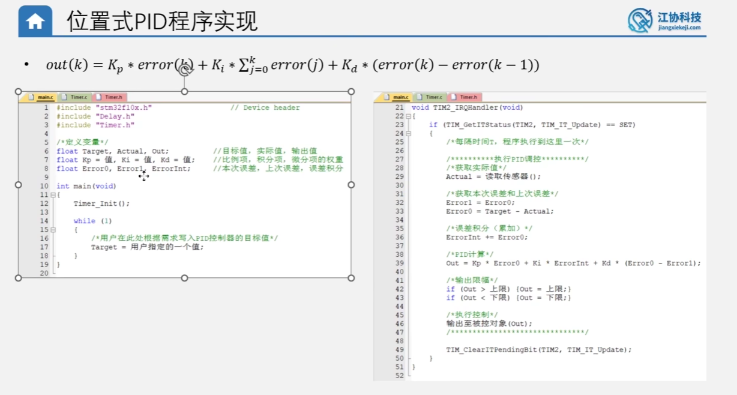
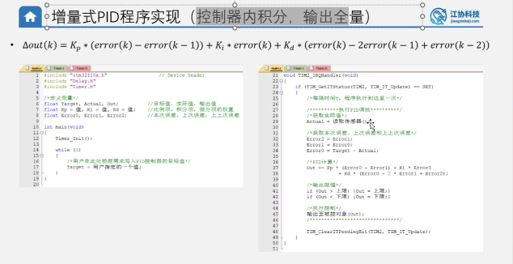

# 位置式 PID 与 增量式 PID 的区别及应用场景

在控制系统中，位置式 PID 和增量式 PID 是最常用的两种数字 PID 算法。它们虽然核心数学原理相通，但在**输出方式**、**计算逻辑**和**适用场景**上有很大区别。

---

## 1. 算法公式与输出含义对比



### 1.1 位置式 PID (Positional PID)
* **输出公式**：
  $$Out(k) = K_p \cdot e(k) + K_i \sum_{i=0}^k e(i) + K_d \cdot (e(k) - e(k-1))$$
* **输出含义**：
  位置式 PID 的输出 $Out(k)$ 直接对应控制执行器的**绝对位置（控制器的全额输出）**。例如：阀门的具体开度（30%）、给电机驱动的绝对 PWM 占空比（70%）等。
* **物理理解**：每次计算都需要将从**系统启动到现在的所有历史误差**进行累加（$\sum e(i)$）。

### 1.2 增量式 PID (Incremental PID)



* **输出公式**：
  增量式 PID 计算的是控制量的**变化增量** $\Delta Out(k)$（即相比上一次输出，这次要增加或减少多少）：
  $$\Delta Out(k) = K_p \cdot (e(k) - e(k-1)) + K_i \cdot e(k) + K_d \cdot (e(k) - 2e(k-1) + e(k-2))$$
  最终作用于执行器的绝对输出为：
  $$Out(k) = Out(k-1) + \Delta Out(k)$$
* **输出含义**：
  输出的是**调节的步长**（增量）。例如：将阀门的开度“调大 2%”或“调小 1%”，将电机 PWM 占空比“增加 5”。
* **物理理解**：计算过程非常精简，**仅与最近 3 次的采样误差有关**（本次误差 $e(k)$、上次误差 $e(k-1)$、上上次误差 $e(k-2)$），不需要累加历史误差。

---

## 2. 核心优缺点对比

| 对比维度 | 位置式 PID | 增量式 PID |
| :--- | :--- | :--- |
| **输出物理含义** | 绝对输出值（如 PWM = 60） | 相对变化增量（如 $\Delta PWM = +2$） |
| **误差依赖性** | 依赖**过去所有**误差的累加，计算量稍大 | 仅依赖**最近 3 次**的误差，计算速度快 |
| **积分饱和风险** | **极高**。误差长期存在会导致积分项累加到极限（饱和），反向调整时需要很长时间消退，导致严重超调。 | **极低**。因为不进行历史误差累加，只要误差为 0，增量输出就为 0。 |
| **系统复位安全性** | **差**。若单片机异常复位，输出瞬间从最大值归零，会对机械结构造成猛烈撞击。 | **好**。控制器复位或丢失时，只输出一个增量，不容易发生输出值的剧烈突变。 |
| **执行机构要求** | 要求执行机构没有累加功能，只接收绝对信号。 | 适合自带积分/累加环节的执行机构。 |

---

## 3. 分别适合应用于哪些场景？

### 3.1 位置式 PID 适合的场景：
1. **位置控制系统**：
   - 比如**舵机角度控制**、**机械臂关节位置**、**3D打印机喷头位置**。这些场景要求输入信号直接对应执行机构的绝对几何位置。
2. **惯性较小、没有物理饱和上限风险的系统**：
   - 比如部分小功率的加热器温度控制。

### 3.2 增量式 PID 适合的场景：
1. **速度控制系统（如直流电机定速）**：
   - 这是增量式 PID 最擅长的领域。在转速控制中，我们每次只需要在当前的 PWM 占空比基础上“微调”（加一点或减一点），此时增量式 PID 极为稳定且不容易超调。
2. **自带累加特性的执行机构**：
   - 比如**步进电机**。步进电机的控制器接收的是脉冲信号（每来一个脉冲就转动一步，相当于物理上的累加器），它本身就是天然的“增量执行器”，极度契合增量式 PID 输出的增量脉冲。
3. **安全系数要求高的工业场景**：
   - 在工业阀门开度控制等大惯性且容易出安全事故的系统中，为了防止单片机死机复位引起阀门剧烈开合，常采用增量式控制来限制调节步长。

---

## 4. 增量式 PID 的暂停维持与无缝启动特性

在实际调试中，我们会发现一个有趣的现象：**当增量式 PID 暂停控制时，输出值 Out 可以直接维持在当前数值；而当控制重新启动时，它也会在当前 Out 的基础上无缝继续执行控制。**

这背后的物理和数学机理如下：

### 4.1 为什么暂停时输出值 Out 能够“维持在当前值”？
* **核心数学原因：输出累加的递推机制**
  在 C 语言代码中，增量式 PID 的输出计算是：
  ```c
  Out += Kp * (Error0 - Error1) + Ki * Error0 + Kd * (Error0 - 2 * Error1 + Error2);
  ```
  核心在于 **`+=`**（累加）这个操作符。用数学递推公式表示即为：
  $$Out(k) = Out(k-1) + \Delta Out(k)$$
  * 当我们“暂停”控制（例如停止 PID 中断计算，或人为屏蔽计算代码）时，这意味着**控制器不再计算新的调节量**，相当于：
    $$\Delta Out(k) = 0$$
  * 带入递推公式：
    $$Out(k) = Out(k-1) + 0 = Out(k-1)$$
  * 也就是说，输出变量 `Out` 将会**直接保留上一时刻计算出来的绝对数值**，并继续平稳地输出给执行器（电机 PWM），使得电机在暂停控制时不会停转，而是维持当前速度继续运转。

---

### 4.2 为什么启动时能“无缝从当前 Out 继续控制”？
* **核心原因一：没有历史积分项（`ErrorInt`）的束缚**
  - **位置式 PID** 严重依赖一个庞大的历史累加积分值（$ErrorInt$）来产生克服负载的“维持电压”（如 $PWM = 60$）。一旦暂停，若将输出归零或重新唤醒，由于积分值需要从 **0** 慢慢“充电”累加，控制量将不得不从 **0** 开始重新建立，导致速度剧烈波动。
  - **增量式 PID** 内部完全没有累加积分项。它的计算只关注**最近 3 次的误差**（本次 $Error0$、上次 $Error1$、上上次 $Error2$）。
* **控制过程无感过渡**：
  - 启动瞬间，控制器被激活。由于 `Out` 变量里**保留着先前的数值**（例如 $60$），PID 计算出的新步长（例如增量 $\Delta Out = +1.5$）直接在原先的 $60$ 上进行累加：
    $$Out_{\text{新}} = Out_{\text{旧}} + \Delta Out = 60 + 1.5 = 61.5$$
  - 控制器直接将当前所处的工作状态（即 $60$ 占空比）视为了“基准线”，并**在此基础上微调**。这使得它在启动时完全不需要经历重新起步的动力爬坡过程，实现了**极其平滑 of 无缝衔接**。

---

## 5. 纯 P 调节下，定位置控制的稳态误差分析

在讨论这个问题时，我们需要将**“理想的控制理论（数学模型）”**与**“真实的物理世界”**分开来看。它们的结论是截然不同的：

### 5.1 理想控制理论下：纯 P 调节定位置控制【没有稳态误差】
* **核心控制理论：被控对象自身就是一个“积分环节”**
  在自动控制原理中，稳态误差与“系统型别”（积分环节的个数）和输入信号类型直接相关。
  - 我们的控制目标是**绝对位置（角度）**。
  - 位置是速度对时间的累积，即：
    $$\text{位置} = \int \text{速度} \, dt$$
  - 这意味着，被控对象（电机本身）的物理机制中，天然就包含了一个**积分环节**（输入 PWM $\rightarrow$ 产生转速 $\rightarrow$ 转速物理积分得到位置）。
  - 根据控制理论，对于阶跃输入（比如目标位置从 0 突变到 100），系统本身只要包含至少一个积分环节（一型系统），即使控制器只是一个**纯比例环节（P）**，闭环系统的理论稳态误差也**刚好等于 0**。

* **通俗物理过程**：
  1. 只要电机还没有到达目标位置（哪怕只差 0.0001），误差 $Error$ 就不为 0。
  2. 只要误差不为 0，比例项就会源源不断地计算出大于 0 的输出 $Out = K_p \cdot Error$。
  3. 只要有输出，电机就会保持旋转（速度 $>0$）。
  4. 只要电机在旋转，位置就会**持续累加（物理积分起作用）**，一步步向目标逼近。
  5. 只有在实际位置完美重合于目标位置的瞬间，误差变为 0，输出归 0，电机速度减为 0 并在目标点静止。这期间**不需要控制器内部具有积分项（I）**。

---

### 5.2 真实物理世界中：纯 P 调节定位置控制【依然存在稳态误差】
虽然理论计算是 0，但在真实实验中，如果只用比例控制（P），电机停下来时**依然会偏离目标值（有静差）**。这是由真实的物理硬伤决定的：

* **致命因素：最大静摩擦力（启动死区）**
  - 在接近目标位置的过程中，误差 $Error$ 逐渐减小。
  - 控制器的比例输出 $Out = K_p \cdot Error$ 也随之成正比减小（例如，计算出的 PWM 降到了仅有 2%）。
  - 然而，实际的电机和减速齿轮箱存在**最大静摩擦力**。电机要动起来，必须要求 PWM 大于一个最小启动门槛（例如必须 $PWM \ge 8\%$ 才能拧得动电机）。
  - 当误差缩小到某个临界值，使得计算输出 $Out < 8\%$ 时，电磁力矩已经无法克服静摩擦阻力，**电机在尚未到达目标点的位置被硬生生卡死**。
  - 此时误差一直存在，但比例项输出由于太弱无法推动电机，这就形成了**实际系统中的稳态误差**。

### 总结：
在**理论上**，因为位置控制的对象自带积分特性，所以纯 P 调节没有稳态误差；但在**工程实践中**，由于静摩擦力“死区”的存在，纯 P 调节依然无法彻底消除静差。这就是为什么在位置控制中，我们最终还是需要引入微小的**积分项（I）**（或通过积分分离），利用积分的持续累加效应来冲破摩擦死区，实现最终的绝对精准定位。


