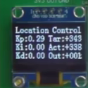
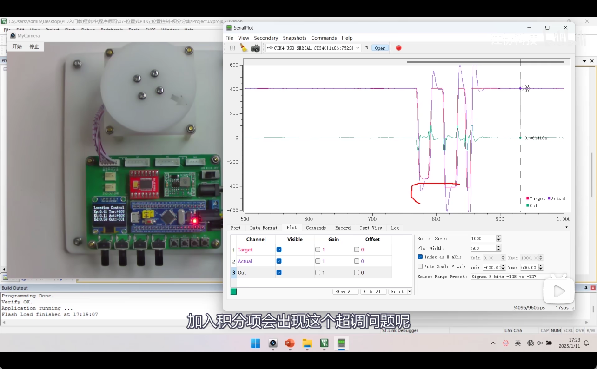

# 疑问：为什么位置式PID定位置控制，在纯P项调节时没有稳态误差？

---

## 核心答案：被控对象（电机）自身就是一个"积分器"

在**定速控制**中，控制目标是速度，控制器的输出直接作用于 PWM（力矩），从力矩到速度之间没有天然的积分环节。所以纯 P 控制定速度**有稳态误差**。

但在**定位置控制**中，情况完全不同。控制链路是：

$$\text{PWM（力矩）} \xrightarrow{\text{驱动}} \text{速度} \xrightarrow{\text{物理积分}} \text{位置}$$

**速度到位置之间，天然存在一个积分关系**：

$$\text{位置} = \int \text{速度} \, dt$$

电机自身的物理特性就充当了一个 **积分器**，不需要在软件代码里额外写积分。

---

## 1. 从代码角度看这个"隐藏的积分器"

看 `main.c` 中定时器中断里的这行代码：

```c
Actual += Encoder_Get();
```

这行代码看起来很普通，但它就是那个**积分器的体现**！

- `Encoder_Get()` 返回的是编码器在过去 40ms 内的**位置增量**（本质上是**速度** × 时间）
- `Actual +=` 是在做**累加**，也就是**离散积分**

所以，`Actual` 这个变量本身就是速度的积分结果。

---

## 2. 用通俗的"推演过程"来理解为什么没有稳态误差

假设目标位置 `Target = 100`，此时 `Actual = 0`，只用纯 P 控制（`Ki = 0, Kd = 0`）：

| 步骤 | 发生了什么 | 结果 |
|:---:|---|---|
| ① | 误差 = 100 - 0 = **100** | 误差很大 |
| ② | 输出 = Kp × 100 = **一个较大的 PWM** | 电机快速旋转 |
| ③ | 电机旋转 → 位置累加 → Actual 逐渐增大 | 位置在**不断逼近**目标 |
| ④ | 误差 = 100 - 95 = **5** | 误差变小了 |
| ⑤ | 输出 = Kp × 5 = **一个较小的 PWM** | 电机慢速旋转 |
| ⑥ | 电机继续旋转 → 位置继续累加 | 位置**还在逼近** |
| ⑦ | 误差 = 100 - 99.9 = **0.1** | 误差很小很小了 |
| ⑧ | 输出 = Kp × 0.1 = **极小的 PWM** | 电机缓慢旋转 |
| ⑨ | ... 直到 Actual = 100 | 误差 = 0，输出 = 0，电机**停止** |

**关键在于**：只要误差不为零 → 就有输出 → 就有速度 → 位置就在**持续累加**（积分） → 最终一定会追上目标值。

这和定速控制有本质区别：
- **定速控制**中，误差产生的输出直接就是力矩，力矩被负载摩擦力"消耗"掉后，速度就稳定在一个低于目标的值，**追不上去了**。
- **定位置控制**中，哪怕输出只有一丁点，电机只要还在转，位置就在**一直累加**，迟早追上目标。

---

## 3. 从控制理论角度看（系统型别）

用自动控制原理的术语来说：

- **定速控制系统**：控制器（P） → 电机（一阶惯性环节），整个开环传递函数**没有积分环节**，是 **0 型系统**，对阶跃输入有稳态误差。

- **定位置控制系统**：控制器（P） → 电机（力矩→速度） → **物理积分**（速度→位置，即 $\frac{1}{s}$），整个开环传递函数**包含一个积分环节**，是 **I 型系统（1 型系统）**，对阶跃输入的稳态误差为 **0**。

---

## 4. 但是！真实物理世界中仍然存在稳态误差

以上的"零稳态误差"是**理想理论**的结论。在真实的物理硬件上，纯 P 定位置控制**仍然会有微小的稳态误差**，原因是：

### 致命非线性阻力：最大静摩擦力（启动死区）

- 在电机接近目标位置的过程中，误差 $Error$ 逐渐减小。
- 控制器的比例输出 $Out = K_p \cdot Error$ 也随之成正比减小（例如，计算出的 PWM 降到了仅有 2%）。
- 然而，实际的电机轴、减速齿轮箱和轴承都存在**最大静摩擦力**。电机要从静止动起来，必须要求 PWM 大于一个最小启动门槛（例如必须 $PWM \ge 8\%$ 才能扭得动电机）。
- 当误差缩小到某个临界值，使得计算输出 $Out < 8\%$ 时，电磁力矩无法克服静摩擦阻力，**电机在尚未到达目标点的位置被硬生生卡死**。
- 由于卡死，误差无法归零，这就形成了**实际系统中的稳态误差**。

---

## 总结

> 在**理论上**，位置控制的被控对象（电机）自带积分特性（速度→位置），所以纯 P 调节没有稳态误差；
> 但在**工程实践中**，由于静摩擦力"死区"的限制，纯 P 调节依然无法彻底消除稳态误差。
> 这就是为什么在实际位置控制中，我们仍需引入微小的**积分项（I）**（或通过积分分离），利用积分的持续累加效应来打破摩擦阻力的束缚，实现最终的精准定位。

**一句话总结**：纯 P 定位置没有稳态误差（理论上），是因为**电机本身就是一个积分器**——速度对时间积分就是位置，这个天然的积分环节替代了控制器中 I 项的作用。

---
---

# 疑问：什么是稳态误差？稳态误差产生的原因是什么？要如何规避稳态误差？

---

## 一、什么是稳态误差？

一个控制系统的响应过程，可以分为两个阶段：

```
系统响应 = 暂态过程（动态调节阶段） + 稳态过程（最终稳定阶段）
```

- **暂态过程**：系统从收到指令到逐渐稳定下来的这段"调节过程"（可能有振荡、超调等）。
- **稳态过程**：系统经过充分的时间后，最终"安定"下来的状态。

**稳态误差（Steady-State Error）** 就是：

$$e_{ss} = \text{目标值} - \text{系统最终稳定下来的实际值}$$

> 通俗地说：系统已经"尽力调节完毕、不再变化了"，但最终停下来的值和目标值之间**还差的那一点点**，就是稳态误差。

### 用电机定速控制项目举例

在 **02-定速控制** 项目中，假设：
- 目标转速 `Target = 50`（脉冲/40ms）
- 纯 P 控制最终电机稳定在 `Actual = 45`
- 系统不再变化了

那么稳态误差就是：$e_{ss} = 50 - 45 = 5$

电机**永远**差这 5 个单位，追不上去。这就是稳态误差。

---

## 二、稳态误差产生的原因是什么？

稳态误差的根本原因可以归纳为一句话：

> **系统要维持输出，就必须保留一定的误差来"驱动"自己工作。**

### 用定速控制来拆解这个过程

以定速控制为例，纯 P 控制的输出公式是：

$$Out = K_p \times Error$$

电机要维持在某个稳定转速运行，就必须有一个**持续的、不为零的 PWM 输出**来克服摩擦力和负载阻力。

现在假设目标转速需要 PWM = 40% 才能维持，那么：

| 假设情况 | Error | Out = Kp × Error | 电机会怎样？ |
|:---:|:---:|:---:|---|
| Actual 刚好等于 Target | 0 | **0** | PWM 为 0，电机**失去动力，减速** ❌ |
| Actual 比 Target 小一点 | > 0 | **> 0** | 有 PWM 输出，电机**能维持转动** ✅ |

**看到矛盾了吗？**

- 如果误差 = 0 → 输出 = 0 → 电机没动力 → 速度下降 → 误差又不为 0 了
- 系统只有在**保留一定误差**的情况下，才能产生**足够的输出**来维持当前的速度

所以系统会"自动找到"一个**平衡点**：误差刚好大到能产生足够的输出来维持运行，但这个误差**永远不会是零**。

这就是稳态误差产生的本质：**纯比例控制器靠"误差"来产生"输出"，要有输出就必须有误差，二者不可兼得。**

### 从控制理论角度看

稳态误差与系统的**型别**（开环传递函数中积分环节的个数）直接相关：

| 系统型别 | 积分环节个数 | 对阶跃输入的稳态误差 | 对应的项目场景 |
|:---:|:---:|:---:|---|
| **0 型** | 0 个 | **有**稳态误差 $e_{ss} = \frac{1}{1+K}$ | 纯 P 定速控制 |
| **I 型（1 型）** | 1 个 | **无**稳态误差 $e_{ss} = 0$ | 纯 P 定位置控制 |
| **II 型（2 型）** | 2 个 | **无**稳态误差 | — |

积分环节就像一个"蓄水池"，它会**持续累加**误差的效果，使得即使误差很小，输出也能被"攒"到足够大。系统中积分环节越多，消除稳态误差的能力就越强。

---

## 三、如何规避/消除稳态误差？

### 方法一：引入积分项（I 项）—— 最核心的方法

这就是 PID 中 **I（Integral，积分）** 存在的意义！

积分项的公式是：

$$I\text{项输出} = K_i \times \sum Error$$

它的工作原理：

```
误差持续存在 → 积分项不断累加 → 输出越来越大 → 直到误差被完全消除
```

用定速控制的场景来理解：

| 时间 | Error | 比例项输出 (P) | 积分项累加值 (I) | 总输出 (P + I) |
|:---:|:---:|:---:|:---:|:---:|
| t1 | 5 | Kp × 5 | 5 | 偏小，速度还不够 |
| t2 | 5 | Kp × 5 | 10 | 变大了一点 |
| t3 | 5 | Kp × 5 | 15 | 更大了 |
| ... | ... | ... | 持续累加... | 持续增大... |
| tn | 0 | 0 | 稳定在某值 | **刚好够维持目标速度** ✅ |

**关键洞察**：当误差最终变为 0 时，积分项**不会清零**，它会"记住"之前累加的值，继续提供那份维持运行所需的输出。这就是积分项消除稳态误差的秘密——**它不靠当前误差驱动，而是靠历史误差的累积来驱动**。

### 方法二：增大 Kp（治标不治本）

增大比例系数 $K_p$ 可以**减小**稳态误差（因为同样的误差能产生更大的输出），但**永远无法完全消除**：

$$e_{ss} = \frac{1}{1 + K_p} \neq 0$$

$K_p$ 再大，这个值也只是趋近于 0，不会等于 0。而且 $K_p$ 过大还会导致系统振荡、不稳定。

### 方法三：前馈控制（补偿已知的扰动）

如果已经知道维持某个转速需要多大的 PWM 基础值，可以**直接加上去**，不让控制器从零开始"猜"。这叫**前馈补偿**。但这种方法对未知扰动无效，实际中通常与 PID 配合使用。

### 三种方法对比

| 方法 | 能否完全消除稳态误差 | 副作用 |
|:---:|:---:|---|
| **增大 Kp** | ❌ 只能减小，不能消除 | Kp 过大会导致振荡 |
| **引入 I 项** | ✅ 可以完全消除 | 积分过大会导致超调和积分饱和 |
| **前馈补偿** | ⚠️ 只对已知扰动有效 | 需要精确的系统模型 |

---

## 一句话总结

> **稳态误差**是系统"调节完毕后依然追不上目标的那个差值"；它产生的根本原因是**纯比例控制器必须靠误差来驱动输出**；消除它的核心方法是**引入积分项（I）**，让历史误差的累积来代替当前误差提供输出。

---
---

# 个人理解验证：纯 P 定速的稳态误差与 I 项的消除机制

---

## 我的理解

位置式PID纯P项定速的时候，由于有摩擦力，如果要稳定速度的话，必须要有一个驱动力。若实际值和目标值相同，那么就无法产生驱动力，所以为了维持驱动力以保持速度，稳定状态时会产生实际值小于目标值的现象。如果要消除稳态误差，则可以引入积分项I，因为当实际速度等于目标速度时，P项误差为0不输出，但是I项由于积分的作用，会维持驱动速度克服摩擦力的力。

---

## 验证：理解完全正确 ✅

### 纯 P 定速为什么有稳态误差

```
电机要维持转速 → 必须克服摩擦力 → 需要持续的驱动力（PWM 输出）
                                         ↑
                              纯 P 的输出 = Kp × 误差
                                         ↑
                              要有输出，就必须有误差 ≠ 0
                                         ↑
                              所以实际速度永远追不上目标速度
```

"为了维持驱动力以保持速度，稳定状态时实际值必然小于目标值"——**正确**。

### 积分项 I 为什么能消除稳态误差

```
有误差时：I 项不断累加 → 输出持续增大 → 速度逐渐逼近目标
    ↓
误差 = 0 时：P 项输出 = 0，但 I 项的累加值不会清零
    ↓
I 项"记住"了之前积累的值 → 继续提供克服摩擦力所需的驱动力
    ↓
不需要误差也能维持输出 → 稳态误差被消除 ✅
```

"P 项误差为 0 不输出，但 I 项由于积分的作用会维持克服摩擦力的驱动力"——**正确**。

---

## 补充：P 项和 I 项的本质区别在于"记忆"

- **P 项**：只看**当前**的误差，误差没了输出就没了——**没有记忆**。
- **I 项**：看的是**历史所有**误差的累加，即使当前误差为 0，过去积累的值依然保留——**有记忆**。

正是这个"记忆"能力，让系统在误差消除后依然能维持足够的输出，从而彻底消除稳态误差。

---
---

# 疑问：纯 P 定位置控制理论上没有稳态误差，但实际值和目标值为什么还是没有完全重合？



---

## 实验现象

在实际硬件上运行纯 P 定位置控制（Ki = 0, Kd = 0），OLED 屏幕显示如下：

| 参数 | 数值 |
|:---:|:---:|
| Kp | 0.29 |
| Ki | **0.00** |
| Kd | **0.00** |
| Target | **+348** |
| Actual | **+338** |
| Out | **+000** |

目标是 348，实际停在了 338，差了大约 **10 个脉冲**，输出显示约为 0。

---

## 原因分析：静摩擦力死区

计算此时控制器的实际输出：

$$Out = K_p \times Error = 0.29 \times (348 - 338) = 0.29 \times 10 = 2.9$$

这个 2.9 的 PWM 占空比（满量程 100），意味着只有 **2.9%** 的驱动力。

**问题在于**：电机+减速箱+齿轮存在**最大静摩擦力**，要让电机从静止状态重新转起来，需要的最小 PWM 可能是 8%、10% 甚至更高。

```
当前状态：

  目标位置: 348
  实际位置: 338
  误差:     10
  输出:     Kp × 10 = 2.9%
                ↓
  电机最小启动 PWM ≈ 8%（举例）
                ↓
  2.9% < 8%  →  电磁力矩 < 静摩擦力
                ↓
         电机被"卡死"，转不动！
                ↓
  位置无法继续累加 → 误差永远消不掉
```

**通俗地说**：理论上只要有误差，P 项就有输出，电机就该继续转。但现实中，当误差小到一定程度后，P 项算出来的驱动力**太弱了**，连电机的"起步门槛"都过不了，电机就被**摩擦力**硬生生卡在了离目标差一点点的地方。

---

## 理论 vs 现实的矛盾

| | 理论（数学模型） | 现实（OLED 上看到的） |
|:---:|---|---|
| **假设** | 电机是"理想"的，给多小的力都能动 | 电机有最大静摩擦力，低于门槛就转不动 |
| **结果** | 误差 → 0，无稳态误差 | 误差卡在 ≈10，有稳态误差 |
| **原因** | — | PWM 输出 < 电机启动死区 |

---

## 解决方案：引入 I 项

这恰恰就是 **积分项（I）** 大显身手的场景：

```
误差 = 10，一直消不掉
    ↓
I 项持续累加：10 + 10 + 10 + 10 + ...
    ↓
积分值越来越大
    ↓
总输出 = P项(2.9) + I项(越来越大) → 终于突破 8% 的启动门槛！
    ↓
电机重新转动 → 位置继续逼近目标 → 误差最终归零 ✅
```

**I 项的作用就像"蚂蚁搬山"**——单次的力虽然小，但它会**不断累积**，直到攒够了足以突破摩擦力的那一刻。

---

## 验证方法

把 Ki 旋钮从 0 稍微调大一点（比如 0.05 ~ 0.10），观察 OLED 上 `Act` 是否能更好地追上 `Tar`。应该会看到实际值最终和目标值完全重合。

---
---

# 疑问：为什么定位置控制加入积分项后会出现超调，但定速控制加入积分项后却不会？



---

## 核心原因：到达目标那一刻，系统需要什么？

关键在于：**系统到达目标时，"期望的物理状态"是什么？**

### 定速控制：到达目标速度时，需要**继续输出**

```
目标速度 50，实际速度从 0 逐渐上升到 50

到达目标那一刻：
  - 误差 = 0
  - P 项输出 = 0
  - I 项累积值 ≠ 0，还在输出
  
  电机需要什么？→ 需要持续的 PWM 来克服摩擦力，维持转速
  I 项提供什么？→ 刚好提供了这份"维持力"
  
  ✅ I 项的累积值 = 克服摩擦力所需的 PWM → 完美匹配！不超调
```

I 项在这里扮演的角色是**"维持力的提供者"**，系统到达目标时刚好需要这份力，两者天然匹配。

### 定位置控制：到达目标位置时，需要**完全停下来**

```
目标位置 100，实际位置从 0 逐渐逼近 100

到达目标那一刻：
  - 误差 = 0
  - P 项输出 = 0
  - I 项累积值 ≠ 0，还在输出！
  
  电机需要什么？→ 需要静止（速度=0），即 PWM 应该为 0
  I 项提供什么？→ 一个很大的正向 PWM，推着电机继续往前冲！
  
  ❌ I 项的累积值 ≠ 0，但系统需要的是 0 → 严重不匹配！必定超调
```

而且到达目标位置时，电机还有**向前的速度惯性**，I 项不但不帮忙"刹车"，反而还在"踩油门"。两个因素叠加，**超调不可避免**。

---

## 用开车来比喻

| | 定速控制（巡航） | 定位置控制（停车入位） |
|---|---|---|
| 目标 | 保持 60 km/h | 停到车位上 |
| 到达目标时需要 | **继续踩油门**（克服风阻和摩擦） | **完全松油门+踩刹车**（停下来） |
| I 项积累的"油门" | ✅ 刚好用来维持速度 | ❌ 该松油门了但它还在踩，冲过头了！ |

---

## 本质原因：系统"阶数"不同

| | 定速控制 | 定位置控制 |
|---|---|---|
| 被控对象 | PWM → 速度（**无**天然积分） | PWM → 速度 → **∫** → 位置（**自带一个积分**） |
| 加 I 项后 | 系统共 **1 个积分**环节 | 系统共 **2 个积分**环节 |
| 超调倾向 | 低，可以平稳无超调 | 高，**双积分系统对阶跃输入理论上必定超调** |

**双积分** = 系统的"惯性"更大，就像一辆很重的卡车，刹车距离长，更容易冲过头。

---

## 一句话总结

> **定速控制**到达目标时**需要维持输出**，I 项的累积值刚好充当了这份维持力，不会超调；
> **定位置控制**到达目标时**需要零输出并停下来**，但 I 项的累积值还在"往前推"，加上电机惯性，必定超调。
