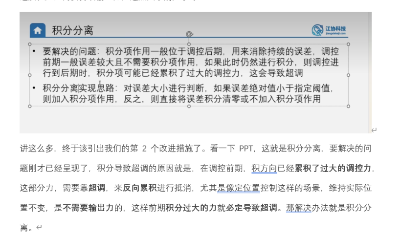
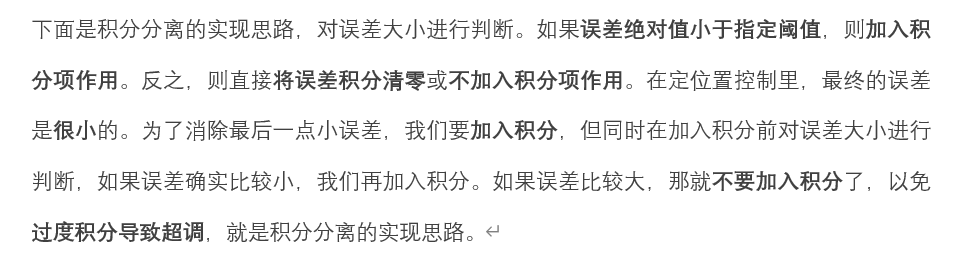

# 位置控制与速度控制中积分项（I）引发超调的深度对比

在电机闭环控制中，我们常常会发现：**定速（速度）控制中加入积分项（I）可以平稳无超调地消除静差；而在定位置控制中，一旦引入积分项，系统几乎必定会产生超调。**

这一现象背后有着深层的物理和控制理论原因，可以通过以下三个维度来通俗、系统地拆解：

---

## 1. 核心物理本质：被控对象的“阶数”不同

控制理论中，系统的超调倾向与系统的“积分环个数”（阶数）密切相关。

### 1.1 定速控制：一阶系统（无天然积分）
* **物理关系**：控制器的输入是 PWM（对应电磁力矩），输出是电机的**转速**。
* **物理特性**：当力矩等于摩擦阻力时，速度就恒定了。输入 PWM 与输出速度是一一对应的关系。如果我们给电机输入一个恒定的 PWM，电机的速度最终会稳定在某个固定值，**速度不会无限制增长**。
* **系统表现**：被控对象（电机本身）不具备积分性质。加入 PID 控制器的积分项后，整个闭环系统仅包含**一个积分环节**（控制器里的 I 对应的一阶系统）。只要 $K_i$ 调得适中，系统可以非常平稳、无超调地消除静差。

### 1.2 定位置控制：二阶系统（自带一个天然物理积分）
* **物理关系**：控制器的输入是 PWM，输出是电机的**绝对位置（角度）**。
* **物理特性**：位置是速度对时间的累积，即：
  $$\text{位置} = \int \text{速度} \, dt$$
* **系统表现**：这意味着**控制对象自身就天然带有一个积分环节**（输入力矩 $\rightarrow$ 产生速度 $\rightarrow$ 物理积分产生位置）。
* **致命矛盾**：当我们在控制器中**再加入积分项（I）**时，整个闭环系统中就存在了**两个积分环节**（控制器的 I 项 + 被控对象本身的物理积分项）。在控制理论中，这种“双积分系统”在阶跃响应下，**如果只有 PI 调节，在理论上必定会产生超调**。

---

## 2. 通俗运行过程拆解：为什么在目标点“刹不住车”？

我们假设将目标从 0 调节到 100，对比一下两种控制在到达目标点时的状态：

### 2.1 定位置控制的过程（必定超调）：
1. **启动与加速**：目标位置 100，当前位置 0。误差很大（$Error = 100$）。电机快速加速旋转，在移向目标位置的过程中，误差一直为正，**控制器内部的积分项 $ErrorInt$ 持续累加变大**。
2. **抵达目标点**：当电机刚好到达 100 的瞬间，误差 $Error = 0$。此时：
   - 比例项输出：$K_p \times 0 = 0$。
   - 积分项输出：处于**历史累积的最大值**（例如 $ErrorInt = 300$）。
   - 此时电机的物理状态：正在以**很高的速度**冲向 100（惯性）。
3. **失控超调**：在目标点，电机需要的是**静止（速度为 0）**。但此时电机不仅有向前的速度惯性，而且控制器内庞大的积分项依然在给电机输出一个正向的 PWM 推动它向前。这两个因素叠加，**电机必定会冲过 100（产生超调）**。

### 2.2 定速控制的过程（可以不超调）：
1. **启动与加速**：目标速度 50，当前速度 0。误差为正，电机加速，积分项 $ErrorInt$ 开始累加。
2. **抵达目标点**：当实际速度刚好达到 50 的瞬间，误差 $Error = 0$。此时：
   - 比例项输出：$K_p \times 0 = 0$。
   - 积分项输出：同样累积到了一个数值（假设为 $PWM = 20$）。
3. **完美平衡**：在目标速度下，电机需要的是**维持这个速度运动**，这就必须克服摩擦力。这个摩擦力所需的 $PWM = 20$ 刚好由积分项提供。此时电机的合外力为 0，加速度为 0，系统刚好平稳地维持在目标速度 50，不需要任何超调。

---

## 3. 总结与工程解决方案

* **定速控制**：到达目标速度时，电机需要持续的输出以克服摩擦力，积分项累积的值刚好充当了“克服摩擦力的维持电压”，所以不一定会超调。
* **定位置控制**：到达目标位置时，理想状态下电机需要静止，不需要输出。但积分项在到达目标前累积的“历史债务”无法被瞬间消除，依然在输出 PWM，所以必定会超调。

### 怎么解决位置控制中的积分超调？

1. **积分分离（当前项目的目标）**：
   在误差很大时（距离目标位置较远时），不进行积分累加，只靠比例（P）和微分（D）将系统快速拉近目标。只有当电机非常靠近目标点（误差极小）时，才开启积分项来消除微小的静差。这样可以避免在加速阶段积累过多的积分“历史债务”，从而大幅压制超调。
2. **微分项（D）的阻尼作用**：
   微分项 $K_d \cdot (Error - LastError)$ 相当于“物理阻尼”（刹车）。当电机快要靠近目标位置时，速度很快，误差减小得很快，微分项会计算出一个很大的反向控制量来主动踩刹车，对抗积分项和惯性，从而抑制超调。

---

## 问题 10：如何实现积分分离？请详细讲解

### 答案：

**积分分离**的本质是给积分项设置一个“启用门槛”（阀值）。当系统误差很大时，不进行积分；只有当误差缩小到设定的安全阀值以内时，才让积分项开始工作。

### 1. 数学控制逻辑

在普通的 PID 计算中引入一个系数 $\beta$：
$$Out = K_p \cdot Error + \beta \cdot K_i \cdot ErrorInt + K_d \cdot (Error - LastError)$$

* 当 $|Error| > \text{阀值 } \text{Threshold}$ 时（距离目标较远）：
  - $\beta = 0$，积分项**停止累加，且不输出作用**。系统仅靠比例（P）和微分（D）快速跟上，避免产生超调。
* 当 $|Error| \le \text{阀值 } \text{Threshold}$ 时（临近目标）：
  - $\beta = 1$，积分项**正常累加并输出作用**。利用积分项消除比例控制带来的静差，实现精准定位。

---

### 2. C 语言代码实现

以当前项目的位置式 PID 为例，在定时中断的 PID 计算逻辑中，我们可以通过简单的 `if-else` 分支结构来实现：

```c
/* 假设设定的积分分离阀值为 50（根据实际脉冲数确定） */
float Threshold = 50.0; 

/* 1. 计算本次误差 */
Error = Target - Actual;

/* 2. 积分分离与累加判断 */
if (abs(Error) > Threshold)
{
    ErrorInt = 0; // 误差太大时，清除之前的累积积分，且不累加本次误差
}
else
{
    ErrorInt += Error; // 误差在阀值以内时，才开始累加误差
    
    /* 配合积分限幅，防止阀值内的积分发生二次饱和 */
    if (ErrorInt > 500)  ErrorInt = 500;
    if (ErrorInt < -500) ErrorInt = -500;
}

/* 3. 计算位置式 PID 输出 */
Out = Kp * Error + Ki * ErrorInt + Kd * (Error - LastError);
```

---

### 3. 如何确定这个“阀值（Threshold）”？

阀值的大小是积分分离能否成功的关键，需要通过实验进行整定：

* **阀值设得太大**：相当于没有进行分离，系统在刚启动时依然会快速累加积分，导致严重超调。
* **阀值设得太小**：可能会让积分项“永远无法启动”。因为纯比例控制（P）存在稳态误差，如果 P 控制把电机拉到离目标还有 $30$ 的位置时，因为动力不够电机停转了。而你的阀值设为了 $20$。此时误差为 $30 > 20$，积分永远不启动，系统就会一直卡在距离目标 $30$ 的地方无法动弹（产生控制死区）。
* **合理确定方法（经验法则）**：
  1. 先只使用比例控制（设置 $K_p \neq 0$，$K_i = 0$，$K_d = 0$）。
  2. 让系统运行，记录电机稳定后与目标点之间的**稳态误差（静差）**范围。假设测得静差在 $40$ 左右。
  3. 将积分分离阀值设为**略大于这个静差的值**（例如设定为 $50$ 或 $60$）。这样，P 控制能把系统拉入 $50$ 以内的范围，进入范围的瞬间积分项立即启动，消除静差，达到无超调精准定位的效果。

---
---

# 疑问：PID定位置项目中，使用积分分离是为了解决定位后积分过大导致的超调问题吗？



---

## 答案：是的，但更精确地说，积分分离解决的是一个矛盾

在定位置控制中，I 项面临一个两难：

| | 不加 I 项 | 加 I 项 |
|---|---|---|
| 远离目标时 | ✅ 没问题 | ❌ 误差大，积分疯狂累加，到达目标时积分过大→**超调** |
| 接近目标时 | ❌ 静摩擦力死区导致电机卡住，有**稳态误差** | ✅ 积分慢慢累积，突破静摩擦力→**消除稳态误差** |

- **远离目标时**：不需要 I 项（P 和 D 就够了），但 I 项在疯狂累积"历史债务"
- **接近目标时**：恰恰需要 I 项来突破摩擦力死区

---

## 积分分离的思路

**既然远离目标时不需要 I 项，那就别让它工作；只有接近目标时才启用它。**

```
误差大（远离目标）→ 关闭积分，清零 ErrorInt → 避免积累"历史债务" → 防超调
误差小（接近目标）→ 开启积分，正常累加   → 利用积分突破摩擦力 → 消稳态误差
```

对应代码里的逻辑（`main.c` 第 108~116 行）：

```c
if (fabs(Error0) < 50)    // 接近目标了
    ErrorInt += Error0;    // ✅ 开启积分，消除稳态误差
else                       // 还远着呢
    ErrorInt = 0;          // ❌ 关闭积分，防止超调
```

---

## 一句话总结

> 积分分离就是**让 I 项只在"最后一公里"发挥作用**——远离目标时靠 P 和 D 快速逼近，接近目标后才让 I 项慢慢积累来消除静摩擦力造成的稳态误差，从而**既防超调，又消静差**。

---
---

# 疑问：积分分离的另一种描述——误差大时用 PD 控制器，误差小时用 PID 控制器，这是为什么？


---

## 答案：这和之前的描述本质是同一件事，只是换了个视角

因为 **P、I、D 三项各有分工**，在不同阶段需要的"人手"不一样：

### 误差大时（远离目标）—— 用 PD 就够了

| 项 | 作用 | 此阶段需要吗？ |
|---|---|---|
| **P** | 提供驱动力，把系统往目标拉 | ✅ 需要，误差大，P 输出大，快速逼近 |
| **D** | 提供阻尼/刹车，防止冲太快 | ✅ 需要，速度快时需要提前减速 |
| **I** | 累积历史误差，消除微小静差 | ❌ **不需要**，此时的任务是"快速赶路"，不是"精细调整" |

此阶段让 I 参与只会**添乱**——它会在赶路途中攒下一大笔"历史债务"，到达目标时变成多余的推力，导致超调。

### 误差小时（接近目标）—— 需要 PID 全上

| 项 | 作用 | 此阶段需要吗？ |
|---|---|---|
| **P** | 提供驱动力 | ⚠️ 误差小，P 输出也小，可能**不够突破静摩擦力** |
| **D** | 阻尼 | ✅ 需要，防止最后阶段的小振荡 |
| **I** | 累积微小误差，慢慢攒力 | ✅ **需要**，P 推不动了，靠 I 慢慢积累突破摩擦力死区 |

---

## 所以"积分分离"就是一个自动切换器

```
          误差大                        误差小
     ┌─────────────┐             ┌─────────────┐
     │  PD 控制器   │  ────→     │  PID 控制器  │
     │  快速赶路    │  误差缩小   │  精细定位    │
     │  I 项休息    │             │  I 项上班    │
     └─────────────┘             └─────────────┘
```

**这两种描述完全等价：**

| 描述方式 | 说法 |
|---|---|
| 从 I 项的角度 | 误差大时关闭积分，误差小时开启积分 |
| 从控制器的角度 | 误差大时用 **PD** 控制器，误差小时用 **PID** 控制器 |

只是观察角度不同，本质是同一件事——**在不需要 I 的阶段把它"分离"出去**，这也正是"积分分离"这个名字的由来。

---
---

# 个人理解验证：积分分离在实际调控过程中的运作方式



---

## 我的理解

积分分离的实现思路是：对误差大小进行判断。如果误差绝对值小于指定阈值，则加入积分项作用。反之，则直接将误差积分清零或不加入积分项作用。

刚进行调控的时候，由于**误差比较大**，所以误差绝对值很可能**大于指定阈值**，所以此时**使用 PD 控制**。当实际位置快与目标位置重合时，**误差很小**，误差绝对值很可能**小于指定阈值**，所以此时**使用 PID 控制**。

---

## 验证：理解完全正确 ✅

整个过程用时间线表示：

```
时间线：
  启动                    接近目标                  到达目标
   │                        │                        │
   ▼                        ▼                        ▼
  误差大 ──────────────→ 误差变小 ──────────────→ 误差≈0
  |Error| > 阈值            |Error| < 阈值            
  ┌──────────┐           ┌──────────┐           
  │ PD 控制   │  ──切换→  │ PID 控制  │  → 精准定位 ✅
  │ I项不工作  │           │ I项开始工作 │           
  └──────────┘           └──────────┘           
```
