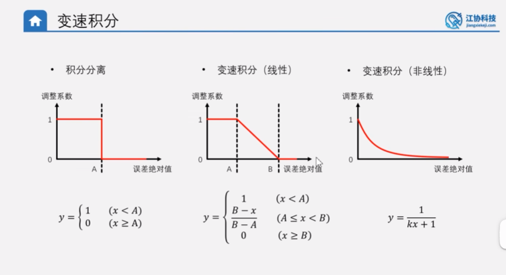

# 位置式PID定位置控制-变速积分 Q&A

## 个人理解验证：变速积分是积分分离的优化

---

### 我的理解

变速积分其实就是积分分离的优化。它不像积分分离那样一刀切，在积分可用与不可用之间转换，而是让积分在全程都可用，只不过是在调控初期，误差比较大，使用 PD 控制更好，所以就削减了 I（积分项）的作用，但是在调控后期误差很小，使用 PID 控制更好，所以就增大了 I（积分项）的作用。



---

### 验证：理解完全正确 ✅

用代码中的系数 $C$ 来对应各阶段的变化（`main.c` 第 109 行）：

$$C = \frac{1}{|Error| + 1}$$

| 阶段 | 误差 | 系数 C | I 项实际累加 | 相当于 |
|---|---|---|---|---|
| 调控初期 | 很大（如 100） | $\frac{1}{101} \approx 0.01$ | `0.01 × Error`，几乎不累加 | ≈ **PD 控制** |
| 调控中期 | 中等（如 10） | $\frac{1}{11} \approx 0.09$ | 缓慢累加 | P**D** + 一点点 **I** |
| 调控后期 | 很小（如 1） | $\frac{1}{2} = 0.5$ | 正常累加 | ≈ **PID 控制** |
| 到达目标 | ≈ 0 | $\frac{1}{1} = 1.0$ | 完全累加 | **完整 PID** |

---

### 与积分分离的核心区别：不再一刀切

```
积分分离：  ████████████░░░░░░░░████████████
            ↑ I=0（关）         ↑ I=1（开）
            硬切换，有突变

变速积分：  ░▒▒▓▓▓████████████████████████
            ↑ I≈0              ↑ I≈1
            软过渡，无突变
```

这种平滑过渡避免了积分分离在阈值边界处的**突变抖动**（误差在阈值附近来回穿越时，I 项反复开关会造成输出跳动），控制效果更柔和。
