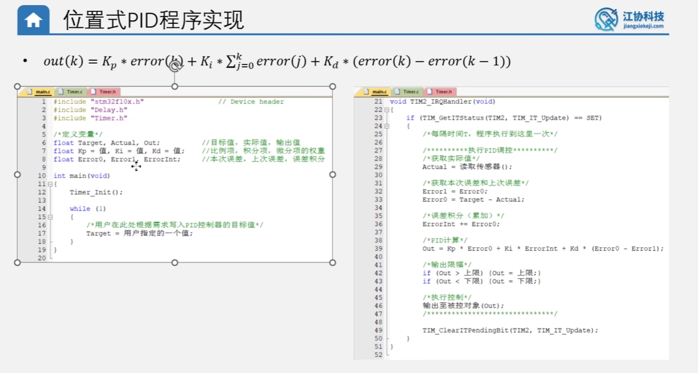
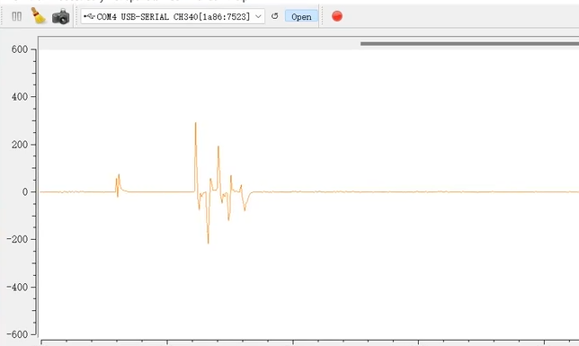

# 问答记录：PID 算法中的积分与微分



---

## 💡 问题一：识别与作用

> **Q: 图中的 PID 公式，哪些是积分哪些是微分？积分与微分的作用是什么？**

### 👨‍💻 解答

在这张图片中的**位置式 PID 公式**和**代码**里，积分和微分分别对应以下部分：

#### 1. 哪个是积分？哪个是微分？

**在数学公式中：**
*   **积分项 (Integral)**：是中间那部分 $K_i * \sum_{j=0}^{k} error(j)$。符号 $\sum$ 表示把从开始到现在的**所有的误差**（error）全部**累加起来**。
*   **微分项 (Derivative)**：是最后那部分 $K_d * (error(k) - error(k-1))$。它计算的是“本次误差”减去“上一次误差”，也就是**误差的变化差值**。

**在右侧的代码中：**
*   **积分项**：对应代码第 `39` 行的 `Ki * ErrorInt`。可以看到第 `36` 行代码 `ErrorInt += Error0;` 就是在**不断地把每一次的误差累加起来**，这就是积分的过程。
*   **微分项**：对应代码第 `39` 行的 `Kd * (Error0 - Error1)`。`Error0` 是本次误差，`Error1` 是上一次误差，它们相减代表了**误差的变化趋势**。

#### 2. 积分与微分的作用是什么？

为了通俗易懂，我们可以把 PID 控制想象成**开车控制车速到 100km/h**。

*   **积分 (I) —— 消除静差，让结果绝对精准**
    *   **通俗解释**：即使比例控制（P）已经把车速加到了 99km/h，如果比例系数不够大，可能就卡在 99km/h 上不去（这就是“静差”）。积分的作用就是**“翻旧账”**，它会把**过去所有的误差都加起来**。只要车速还没到 100km/h，哪怕每次差 1km/h，时间久了积分也会累加成一个很大的数值，从而给油门一个**额外的力量**，硬生生把车速推到正好 100km/h。
    *   **🎯 核心总结**：消除稳态误差，确保最终控制结果 100% 达到目标值。

*   **微分 (D) —— 预测未来，防止冲过头**
    *   **通俗解释**：假设你的车速现在是 80km/h，一脚油门下去，下一秒变成了 95km/h。车速上升得太猛了！如果继续踩油门，马上就会超速（超过 100km/h，这叫“超调”）。微分的作用就是**“预测趋势”**，它通过计算前后两次误差的差值，发现**误差在急剧缩小**，就会**提前踩一脚刹车**（产生一个**反向阻力**），防止车子冲过头。
    *   **🎯 核心总结**：增加系统的阻尼（像弹簧的减震器），抑制震荡和超调，让系统更快、更平稳地停在目标值上。

<br>

---

## 💡 问题二：微分突变与微分先行

> **Q: 纯 D 相控制的时候，切换目标值，输出项会产生很大的尖峰。产生的原因我理解的是：当目标值切换时，实际值与目标值差值最大，所以 D 相输出的力最大；随后实际值接近目标值，D 相输出越来越小。随着实际值越来越接近，(Error0 - Error1) 逐渐由正变负，此时出现反相调控力（阻尼），这个阻尼是好的，因为它能预测未来趋势、防止超调。**
>
> 这样理解对吗？
>
> 

### 👨‍💻 解答

你的思考非常深入！你对后半部分**阻尼作用（预测趋势、防止超调）**的理解是**完全正确**的。

但是，关于前半部分“尖峰”产生的原因，有一个微小但非常关键的理论误区：

#### 1. 纠正误区：为什么会产生巨大的尖峰？

你提到：“当目标值切换的时候，此时实际值与目标值差值最大，所以 D 相输出的力最大”。
实际上，**“因为差值最大而输出最大”描述的是 P（比例）项 的特征，而不是 D（微分）项。**

**D（微分）项产生巨大尖峰的真正原因是：在切换目标值的瞬间，误差发生了“瞬间的剧烈跳变”（变化率近乎无穷大）。**

我们来拆解 D 项的公式：
```c
微分输出 = Kd * (本次误差 Error0 - 上次误差 Error1)
```

当你在某一时刻突然修改了目标值（比如从 0 突变到 100）：
*   **上次误差 (Error1)**：是基于 **旧目标值** (0) 算出来的。
*   **本次误差 (Error0)**：是基于 **新目标值** (100) 算出来的。

就在这一瞬间，`(Error0 - Error1)` 的结果会是一个**极其巨大的差值**（就等于你目标值的变化量 100）。微分的本质是对**“变化率”**敏感，它检测到了这个瞬间的、断崖式的突变，于是为了猛烈地“抵抗”这个变化，它输出了一股极大的力，这就导致了波形图中的那个直插云霄的尖峰。

> ⚠️ **专有名词**：在自动化工程上，这个现象叫做 **“微分突变” (Derivative Kick)**。这通常是有害的，因为它可能会瞬间输出过大的电压烧毁电机或者导致机械结构猛烈震荡。

#### 2. 完美闭环：这正是“微分先行”要解决的问题！

你当前正在学习的这个工程文件夹名字叫 **`09-位置式PID定位置控制 - 微分先行`**。
**“微分先行” (Derivative on Measurement)** 正是专门为了解决这个“尖峰（微分突变）”而被发明出来的优化算法！

**解决思路是这样的：**
为什么会有突变？是因为**“目标值”**是可以被人为瞬间改变的。
那有什么东西是不会瞬间跳变的？是**“实际测量值 (Actual)”**。物理世界的电机位置、温度、车速都是有惯性的，只能连续平滑地变化。

所以，在“微分先行”算法中，我们**不再对“误差”求微分，而是直接对“实际测量值”求微分。**

*   **标准的 D 项**：`Kd * (本次误差 - 上次误差)`
*   **微分先行的 D 项**：`Kd * (上次实际值 - 本次实际值)`

> ℹ️ *注：数学推导上，如果目标值不变，(误差变化) = -(实际值变化)。所以只需把微分项里的误差换成实际值，并调换一下减法的顺序即可。*

**这样做的好处是神级的：**
1. 无论你怎么疯狂切换目标值，因为微分项里根本没有目标值参与计算，所以**绝对不会再产生尖峰**。
2. 同时，随着实际值不断接近目标值，实际值本身的变化率会被捕获，依然能完美保留你刚才理解的**“反向调控力（阻尼）”**，继续防止超调！

<br>

---

## 💡 问题三：积分与微分的通俗计算方式

> **Q: 积分，是本次与上一次的值相加；微分，是本次与上一次的值相减，是吗？**

### 👨‍💻 解答

你总结的大体方向是对的，尤其是微分部分！但关于**“积分”**的说法需要稍微修正一点点，这样会更加严谨。

我们可以这样来精确理解：

#### 1. 微分 —— 你的理解完全正确！👍
微分在数字程序里，确实就是：**“本次的值” 减去 “上一次的值”**。
它求的是一个**差值**。它只关心最近这两次的变化，用来判断当前是“变大了”还是“变小了”，以及“变得有多快”。
*   **代码体现**：`本次误差 - 上次误差` （只用到两个数）

#### 2. 积分 —— 需要稍微升级一下概念 🤏
积分**不是**仅仅把“本次的值”和“上一次的值”这两个数相加。
积分是：**把“本次的值”不断地累加到“过去所有历史值的总和”里面**。

打个存钱的通俗比方：
*   **微分**看的是：你今天比昨天多存了多少钱？（两天的差额）
*   **积分**看的是：从你第一天开始存钱一直到今天，存钱罐里**总共**攒了多少钱？（所有天数的累加）

所以在实际的 C 语言代码中，你会看到它们巨大的区别：

*   **计算微分时**：每次算完，上次的值就没用了，下次会被新的值覆盖。
*   **计算积分时**：会有一个专门的变量（比如叫 `ErrorInt`）像滚雪球一样，每次都加上最新的误差。
    ```c
    ErrorInt = ErrorInt + Error0; // 把本次误差(Error0)累加进历史总和(ErrorInt)里
    ```

**用一句话来最终概括：**
*   **微分**是求**“最近两次的差”**。
*   **积分**是求**“从古至今的累加和”**。

<br>

---

## 💡 问题四：微分先行的核心目的

> **Q: 微分先行解决的是目标值变化很大时，导致D相的输出值变得很大，从而导致输出项会产生很大的尖峰导致超调的问题。我的理解正确吗？**

### 👨‍💻 解答

**完全正确！💯 你的理解已经非常精准地抓住了“微分先行”的核心本质。**

为了让你对这个概念的掌握更加炉火纯青，我们可以把你说的这句话里“尖峰导致的后果”再稍微拓展一点点：

你提到尖峰会“导致超调”，这在某些系统中确实会发生（因为瞬间给的力太猛了，导致惯性极大）。但其实，这种由于“目标值突变”引起的 D 项尖峰，更可怕、更直接的危害是**对硬件执行机构的“猛烈冲击”**。

我们可以打个极其形象的比方，假设你设计了一个控制电机转速的 PID 系统：
当前转速是 `100转/分`，你突然把目标转速改成了 `1000转/分`。

*   **如果不加微分先行（传统 PID）**：
    就在你修改目标值的这一瞬间，D 相算出来的误差变化率极其巨大，它会瞬间输出一个也许高达几千、甚至上万的电压值（虽然会被限幅，但一定会瞬间拉满）。这相当于系统**“一脚把电门瞬间踹断”**。
    **后果**：电机瞬间流过极其庞大的冲击电流，可能会直接烧毁驱动芯片；同时电机的机械齿轮会发出“哐”的一声巨响，长期这样操作，机械结构很快就会报废。

*   **加了微分先行（你理解的版本）**：
    无论你把目标值怎么突然改变，D 相都“视而不见”。它只死死盯着电机**当前的真实转速**。
    **后果**：因为 P 项（比例）看到了差值很大，所以它会开始让电机加速。在这个加速的过程中，D 项（微分）依然在正常工作，它不断检测真实转速上升得快不快，并提供你前面提到的**“反相调控力（阻尼）”**。最终，电机平滑、快速且没有尖峰地加速到了 1000 转，完美保护了硬件，同时防止了超调。

**总结一下：**
你的总结非常到位！“微分先行”就是为了在**保留 D 项防止超调的优点的同时**，剔除掉**因为“人为目标值突变”而引起的“破坏性尖峰”**，让系统的控制既精准又丝滑！

<br>

---

## 💡 问题五：微分先行的数学推导与工程意义

> **Q: 为什么微分先行的实现策略是，将差值的运算改成实际值的运算？且前面的系数还需要变为负数？**

### 👨‍💻 解答

这是一个非常棒、非常硬核的底层逻辑问题！要回答这个，我们需要做一点点简单的代数推导，看完推导你马上就会恍然大悟。

#### 1. 为什么会多出一个负号？（数学推导）

在标准的 PID 控制中，误差的定义是：
**误差 = 目标值 - 实际值**

我们先写出**标准 D 项**的计算公式：
`D输出 = Kd * (本次误差 - 上次误差)`

现在，我们把“误差”的定义老老实实地代入到公式里：
*   `本次误差 = 目标值 - 本次实际值`
*   `上次误差 = 目标值 - 上次实际值`

代入后展开：
`D输出 = Kd * [ (目标值 - 本次实际值) - (目标值 - 上次实际值) ]`

让我们打开括号，整理一下：
`D输出 = Kd * [ 目标值 - 本次实际值 - 目标值 + 上次实际值 ]`

看！神奇的事情发生了：如果目标值在这个极其短暂的控制周期内没有被修改，那么公式里的**两个“目标值”一正一负，正好互相抵消了！**
最后剩下的部分就是：
`D输出 = Kd * ( - 本次实际值 + 上次实际值 )`

我们把负号提出来，公式就变成了最终的形态：
**`D输出 = - Kd * ( 本次实际值 - 上次实际值 )`**

**结论：**那个“负号”根本不是工程师为了玄学凭空捏造加进去的，而是**数学推导过程中必然产生的结果**。从物理意义上理解：实际值和误差是“此消彼长”的关系。实际值往上跑，误差就往下掉。它们变化的方向是反的，所以必须加个负号，才能保证微分原本的“阻尼（刹车）”方向不反掉。

#### 2. 为什么要改成实际值的运算？（工程意义）

通过上面的数学推导，我们发现了一个惊人的事实：
只要目标值不动，**【对误差算差值】和【对实际值算差值再加个负号】，这俩在数学上是 100% 完全相等的！**

那么问题来了，既然平时结果都一样，工程师为啥吃饱了撑的非要改成算“实际值”呢？
这就是为了专门对付**“人为瞬间修改目标值”**的那一刻！

*   **如果坚持用老公式算“误差”：**
    一旦你手快，突然改变了目标值。那么在切过去的瞬间，`本次目标值` 和 `上次目标值` 就不一样了，它们就**无法抵消**了！这会凭空炸出一个巨大的数值，这也就是引发**“破坏性尖峰（微分突变）”**的万恶之源。

*   **如果换成新公式算“实际值”（微分先行）：**
    再看看推导出的新公式：`D输出 = - Kd * ( 本次实际值 - 上次实际值 )`
    在这个公式里，**“目标值”这个变量已经被彻彻底底地开除出局了！整个公式里根本没有目标值的影子！**
    这意味着，无论你在上位机怎么疯狂地、一瞬间把目标值改来改去，这段 D 项代码连看都不看一眼。它就像个冷酷的保镖，只死死盯着电机**真实转速**的变化。因为真实世界的转速是有物理惯性的，不可能一瞬间跳变。所以算出来的 D 项永远是平滑的，彻底把尖峰扼杀在了摇篮里。

**🎯 一句话总结：**
*   **改成实际值**：是为了把随时可能人为突变的“目标值”彻底从公式里踢出去，防止它作妖引发尖峰。
*   **变成负数**：是因为数学推导上，实际值的变化方向和误差的变化方向正好是相反的。

<br>

---

## 💡 问题六：D项的副作用与是否引入D项的抉择

> **Q: 现在微分先行的作用就是全程提供阻尼是吗？实际值变化的越快，阻尼越大；实际值变化的越慢，阻尼越小。由于D相是提供阻尼的作用，加入D相反而会让实际值到目标值跟踪变慢，所以需要看情况加入D相调节是吗？**

### 👨‍💻 解答

完全正确！你的直觉非常敏锐，已经完全看透了 D 项的本质及其作为“双刃剑”的特性！

#### 1. 关于阻尼的理解（完全正确）
微分先行（包括普通的微分项）在系统中的核心表现就是**“全程阻尼器”**。
*   物理意义上，它就像把你的电机泡在了一缸粘稠的蜂蜜里。
*   你运动得越快（实际值变化越快），这缸蜂蜜给你的反向阻力（阻尼）就越大。
*   你慢慢动，阻力就几乎感觉不到。

#### 2. 加入 D 项会拖慢系统响应吗？（是的！）
这就是控制工程中著名的**“水桶效应（权衡）”**：
天下没有免费的午餐。D 项既然能拉住系统不让它冲过头（防止超调），那它必然也会在系统拼命想加速靠近目标值的时候，**扯它的后腿**。

*   **代价**：加入 D 项后，系统从 0 到达目标值的**上升时间 (Rise Time) 会变长**，也就是你说的“跟踪变慢”了。

#### 3. 所以要看情况加入 D 相吗？（非常需要看情况！）

在实际工业界，并不是所有的系统都要用完整的 PID。**事实上，绝大部分普通的工业控制只用 PI（比例-积分），根本不加 D！**

那么什么时候加，什么时候不加呢？
*   **坚决不加 D 的情况（只用 PI）**：
    1.  **传感器噪声大**：如果你的测速传感器或者温度计读数一直在**轻微抖动**，D 项会对这种高频抖动极其敏感，把它**无限放大**，导致电机疯狂抽搐。
    2.  **系统本身响应很快，且不怕轻微超调**：比如简单的水流流量控制，哪怕超了一点点也能马上回落，没必要牺牲响应速度去加 D。
*   **必须加 D 的情况（用 PID）**：
    1.  **系统惯性极大（滞后严重）**：比如大锅炉的**温度控制**，或者重型机械臂的**精确位置控制**。这种系统一旦动起来，就算你拔了电源它也要往前冲很久，极容易严重超调。这时候**必须**引入 D 项的“提前预测、提前刹车”功能，宁可让它走得慢一点，也绝对不能让它冲过头撞坏设备。

**🎯 总结：**
D 项是一剂猛药，能治**超调**，但副作用是**拖慢响应**和**放大噪声**。用不用它，全看你控制的这台机器到底是什么“脾气”！
