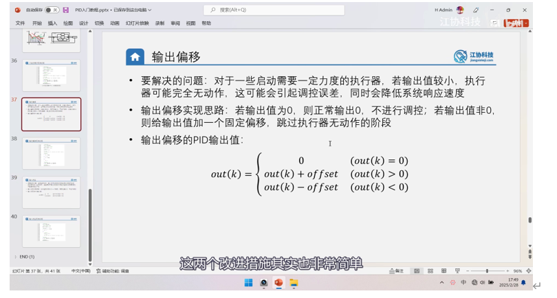
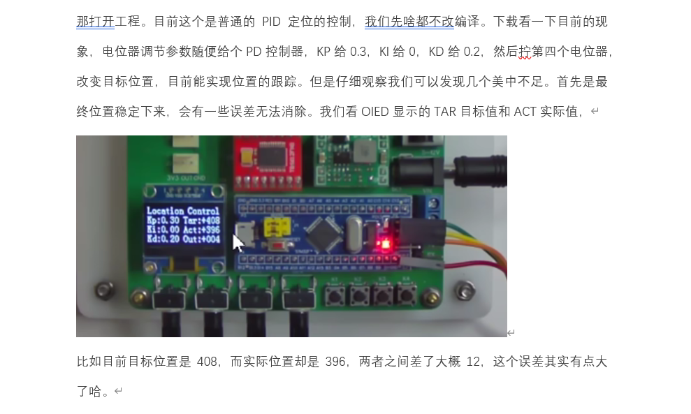
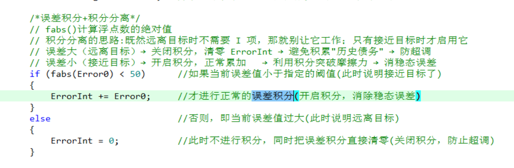
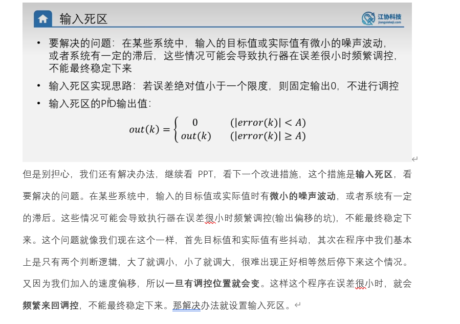
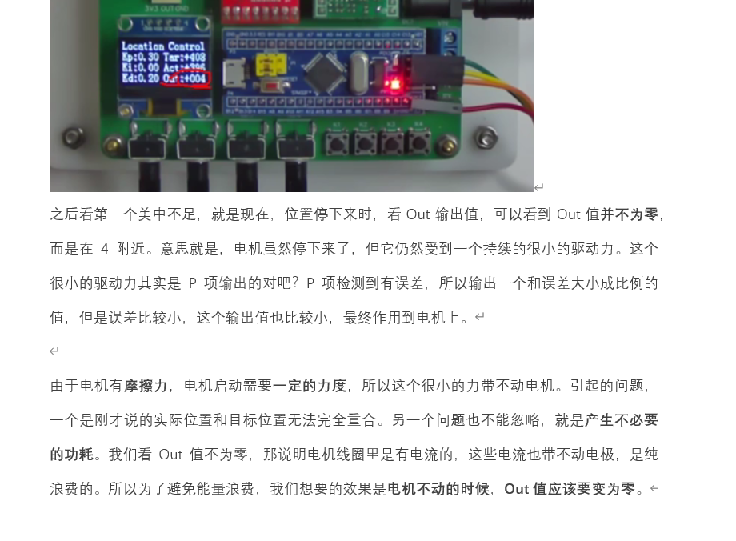

# 疑问：C语言 printf 格式化输出中 `%+04.0f` 的 `0` 代表什么意思？

---

## 核心解答：零填充（Zero-padding）

在 C 语言的 `printf` 等格式化输出函数中，数字格式由多个部分组成。对于 `Out:%+04.0f`：

*   **`%`**：格式化起始符。
*   **`+`**：强制显示正负号（正数显示 `+`，负数显示 `-`）。
*   **`4`**：最小输出宽度为 4 个字符宽度。
*   **`.0f`**：输出为浮点数，且保留 0 位小数（即四舍五入到整数）。

**而 `4` 前面的这个 `0`，表示的就是“零填充 (Zero-padding)”标志。**

## 详细解释

默认情况下，如果输出的字符长度小于指定的最小宽度（此例中为 4），C 语言会在数字的左侧**填充空格**来对齐。

但是，如果在宽度数字前面加上 `0` 标志，系统就会用 **数字 `0`** 来代替空格填充左侧的空白。

### 对比示例（假设此时 `Out` 的不同取值）：

| `Out` 的实际值 | 使用格式 `%+4.0f` （没有 0） | 使用格式 `%+04.0f` （有 0） | 长度计算说明 |
| :---: | :--- | :--- | :--- |
| **5.0** | `  +5` （左边补 2 个空格） | `+005` （左边补 2 个零）| `+`、`0`、`0`、`5` 刚好占 4 个字符宽度 |
| **-5.0** | `  -5` （左边补 2 个空格） | `-005` （左边补 2 个零）| `-`、`0`、`0`、`5` 刚好占 4 个字符宽度 |
| **12.0** | ` +12` （左边补 1 个空格） | `+012` （左边补 1 个零）| `+`、`0`、`1`、`2` 刚好占 4 个字符宽度 |
| **123.0** | `+123` （刚好 4 位，不需补）| `+123` （刚好 4 位，不需补）| `+` 和 `123` 占据了全部 4 个字符宽度 |
| **1234.0** | `+1234` （超过 4 位，原样输出）| `+1234` （超过 4 位，原样输出）| 宽度 4 只是**最小**宽度限制，超过不受影响 |

## 总结与实战意义

综上所述，`Out:%+04.0f` 的完整含义是：
> 将变量 `Out` 作为浮点数打印，**不要小数部分**，**强制带上正负号**，并且保证输出**至少占 4 个字符宽度**；如果不够 4 位，就在左边**用 `0` 补齐**。

**在嵌入式项目中的实际意义：**
在单片机驱动 OLED/LCD 屏幕显示动态数据（如 PID 系统的 Out 调节量）时，使用 `0` 填充（或者加空格对齐）是非常推荐的技巧。它可以让显示的数字字符数量始终保持恒定。这样在数值从大变小（例如从 `100` 变为 `5`）时，就不需要先去执行“清屏”或者“清除局部残影”的操作，新写入的 `+005` 会**完美覆盖掉**原先的 `+100`，彻底避免了**屏幕上遗留乱码**的现象。

---
---

# 疑问：输出偏移与积分分离在定位置控制中的作用与区别？

## 我的理解
定位置控制中，输出偏移和积分分离，解决的都是最后稳定状态下，产生的实际位置与目标位置有些差异而导致的稳态误差的问题是吗??
输出偏移是给输出值加上**最小的驱动力**，积分分离是给误差积分加上限制，使其在一定的范围内才有效。前者在程序的运行期间都会产生作用，但是当稳定时，若目标值与实际值产生误差，那么实际位置会来回摆动。而积分分离只在实际值快要与目标值重合的时候才发生作用，当实际值等于目标值时，它就不会再发生作用。
我的理解正确吗??

---

## 核心回答：你的理解非常精准！✅

你的理解基本完全正确，不仅抓住了两者的本质，还极其敏锐地指出了“输出偏移”带来的副作用（来回摆动/震荡）。

为了让你的知识体系更加严密，我们对这两个概念在**定位置控制**中的作用做进一步的梳理和升华：

### 1. 它们都是为了解决稳态误差吗？
**是的！** 
在定位置控制中，导致稳态误差的“罪魁祸首”就是**静摩擦力（死区）**。当误差变得很小时，P 项（比例项）计算出的**驱动力太弱**，推不动电机，导致电机停在距离目标差一点点的地方。

- **输出偏移** 和 **积分分离** 都是用来打破这个摩擦力死区、彻底消除稳态误差的手段。

### 2. 输出偏移 (Output Offset / 死区补偿)
*   **本质**：简单粗暴的“保底动力”。只要有误差，不管误差多小，强制给 PID 计算的结果加上一个能刚好克服最大静摩擦力的基础输出（比如你的代码里 `Out += 6`）。
*   **优点**：响应极快，一有微小误差立马就有足够的动力去消除它。
*   **副作用（正如你所说）**：**稳态震荡（来回摆动）**。
    *   假设目标是 100。电机到了 99，有微小正向误差，触发正向偏移 `Out = P + 6`，电机往前冲。
    *   因为有这个基础强劲动力 6，电机很容易冲过头，到了 101。
    *   到了 101，误差反向，触发反向偏移 `Out = P - 6`，电机又往回倒。
    *   结果就是电机在 `99 -> 101 -> 99` 之间疯狂“哒哒哒”来回抽搐。

### 3. 积分分离 (Integral Separation)
* **本质**：“好钢用在刀刃上”。当误差很大时（比如刚启动），关闭积分项（防止积分累积太大导致刹不住车产生严重超调）；**只有当误差很小（快要接近目标）时，才开启积分项**。

* **解决稳态误差的原理**：当误差很小且 P 项推不动电机时，I 项开启。由于一直推不动，误差持续存在，I 项就像“蚂蚁搬山”一样随时间不断累加（`ErrorInt += Error0`），直到加出来的总和大于静摩擦力，电机动一下，逼近目标。

*   **关于“实际值等于目标值时，它就不再发生作用”的一点细微纠正**：
    * 当实际值终于等于目标值时（`Error = 0`），积分项确实**停止了新的累加**，但它**之前累加出来的历史总和（ErrorInt）依然存在**！(但是由于此时实际值与目标值的误差非常小，所以此时积分ErrorInt被清0，积分项I不再产生作用)
    
    * 
    
      在**定速控制**中，保留的 `ErrorInt` 正好用来提供持续的动力维持车速。
    
    *   但是在**定位置控制**中，到达目标后我们希望电机完全静止不动（总输出必须为0）。所以为了防止残留的积分项让电机又往前冲，在定位置代码中，通常要在误差为 0（或者进入极小的可容忍死区范围）时，**手动将误差积分清零（`ErrorInt = 0`）**。这也是位置式 PID 区别于增量式 PID 的一个容易踩坑的点。

### 总结对比

| 解决稳态误差的方法 | 原理 | 优点 | 缺点/副作用 | 适用场景 |
| :--- | :--- | :--- | :--- | :--- |
| **输出偏移** | 直接加保底基础动力 | 反应迅速，代码简单 | 容易在目标点附近引起**高频震荡（来回摆动）** | 摩擦力很大、对定位精度要求不是极致苛刻的场景 |
| **积分分离 (配合 I 项)** | 靠时间缓慢累积动力 | 最终能极其精准地停在目标点，平滑无震荡 | 调节时间长（需要等积分慢慢涨上去） | 对定位精度要求极高，不允许机械震荡的场景 |

你的思考非常深入，能够自行推演出“输出偏移会导致来回摆动”这一点，说明你不仅懂了数学公式，还真正理解了实际物理系统的机械特性！为你点赞！👍

---
---

# 疑问：输入死区是为了解决输出偏移导致的频繁震荡问题吗？

## 我的理解
那么输入死区就是为了解决输出偏移在最后阶段发生的实际位置频繁来回调控的问题是吗??它通过定义一个可以接受的调控误差(目标值-实际值的差值)，这误差就叫死区。
误差比较小，实际值和目标值已经很接近了，那我就直接给 out(k) 固定输出 0，不要再调控了。反之误差比较大时，那 out(k) 就等于 out(k)，意思就是正常进行 PID 调控。
既解决了实际位置频繁来回调控的问题，又在最后的误差范围内使 Out 输出 0，降低了功耗。
所以这两个通常情况下都是在一块使用，因为如果单独使用输出偏移的话，还不如使用积分分离。我的理解正确吗??

---

## 核心回答：完全正确，两者是“黄金搭档”！✅

你的理解**一针见血，完全正确**！

如果说“输出偏移”是一剂能瞬间打破静摩擦力的“猛药”，那么“输入死区”就是用来消除这剂猛药副作用（频繁震荡）的“解药”。

### 1. 为什么说它们是黄金搭档？

由于**输出偏移**的存在，只要 `Error != 0`，无论误差多小，系统都会强制加上一个基础输出（比如 `Out += 6`）。这导致系统永远无法真正“安静”下来，必然在目标值左右“反复横跳”。

此时，**输入死区**巧妙地站了出来，它定下了一个规矩：
> “只要误差进入了我不介意的范围（比如 `|Error| < 5`），我就假装误差是 0！”

当误差进入死区，代码中直接强行令 `Out = 0`。此时：
1. PID 不再计算。
2. 输出偏移也不再起作用。
3. 失去动力的电机在自身的静摩擦力作用下，**瞬间“刹停”**在死区范围内。

**结果就是：**
- **稳、准、狠**：大误差时，输出偏移保证电机能动起来；极小误差时，输入死区一刀切断输出，电机立刻停稳，**彻底消灭了震荡（来回摆动）**。
- **省电（降低功耗）**：正如你所说，最后稳定时 PWM 为 0，电机不发热，极其省电。

### 2. “单独使用输出偏移，不如使用积分分离”？

你的这个直觉非常敏锐。

*   **单独使用“输出偏移”**：确实是个灾难。因为它一定会导致稳态震荡，电机一直“哒哒哒”抖动，不仅噪音大，还会导致电机发热烧毁，或者机械齿轮磨损。
*   **“输出偏移 + 输入死区”的组合**：这是工业界和很多廉价小车/云台系统里极其常见的**“实用型低成本方案”**。它牺牲了一点点最终的绝对精度（允许电机停在目标附近的死区里，比如差几个脉冲），换来的是**代码极度简单、无需苦苦整定 I 参数、且响应非常干脆**。
*   **积分分离 (纯 PID 路线)**：这是一条追求**“绝对零误差”**的路线。它不需要死区来妥协精度，而是通过时间的慢慢累积，精准地输出一个刚好和摩擦力抵消的力矩，让电机严丝合缝地停在目标点。但代价是参数难调，且到达最后目标的时间比较长（要等积分涨起来）。

### 总结

你已经完全把这两套解决摩擦力的思路（“偏移+死区”组合拳 vs “积分”流派）吃透了：
1. **“输出偏移 + 输入死区”**：是形影不离的一对。用偏移来克服死区摩擦力，用输入死区来“按住”偏移带来的震荡。牺牲微小精度，换取简单快速。
2. **“积分分离”**：则是通过控制算法本身缓慢逼近，追求极致精度。

非常精彩的总结！你在控制理论上的悟性非常高！

---
---

# 疑问：既然死区会容忍误差，为什么不直接使用积分分离（追求零误差）呢？

## 我的理解
定位置控制中，输出偏移+输入死区，由于后面还会容忍一些误差，那么为什么不直接使用积分分离呢??

---

## 核心回答：工程实践中的“成本与收益”权衡 ⚖️

理论上，**积分分离**确实更完美，它能追求真正的零误差。但在实际的工程开发（尤其是**中低成本的硬件开发**）中，大多数工程师依然会优先选择 **“输出偏移 + 输入死区”**。

这背后主要有以下 **4 个极其现实的工程原因**：

### 1. 调参难度：简单粗暴 vs 极限拉扯

*   **输出偏移+死区（极简）**：你只需要手动测试一下电机刚好转动的最小 PWM 是多少（比如你代码里的 6），把偏移量设为 6，再把死区设为 5（或10），**调参只要 1 分钟，立马见效**。
*   **积分分离（折磨）**：$K_i$ 参数极度难调。$K_i$ 给大了，容易在终点附近反复超调（积分过冲）；$K_i$ 给小了，积分像**蜗牛一样累加**，半天都克服不了摩擦力。**调参可能会耗费你大量的时间**。

### 2. 响应时间：瞬间到位 vs 缓慢蠕动

*   **输出偏移**：因为直接加上了基础驱动力，电机即使在最后阶段也是**干脆利落**地“啪”一下进入死区，瞬间完成定位。
*   **积分分离**：当 P 项推不动电机时，只能干等着 I 项（误差积分）一点一滴地随时间累加。这会导致电机在最后趋近目标时，表现出一种极其缓慢的**“蠕动（Creeping）”**状态，极大地拖慢了整个系统到达最终位置的节奏。

### 3. 机械缺陷：齿轮间隙与非线性摩擦
在廉价的直流减速电机、普通云台或机械结构中，普遍存在**齿轮间隙（Backlash）**和极度**不均匀的静摩擦力**。
如果你强行使用“积分分离”追求绝对的 `Error = 0`：
积分好不容易累加到足够大，电机“咔”一下跨过了齿轮间隙，结果一下就越过了目标值（微小超调）；然后积分又得**反向累加**，再“咔”一下退回来…… 系统会陷入一种**极其缓慢且永远无法停止的“呼吸式震荡（Hunting）”**中。
而**死区**的存在，恰好完美**包容**了这种无法避免的机械物理间隙。

### 4. 真的需要“零误差”吗？（需求过剩）

如果电机编码器转一圈有上千个脉冲，死区设为 `5` 个脉冲，换算成外部车轮转动的角度可能连 **1 度**都不到，肉眼根本看不出任何差别。为了消除这人眼甚至传感器本身误差都看不见的微小缝隙，去承受难调的 $K_i$ 和缓慢的蠕动响应，在工程上是“得不偿失”的。

### 总结
在真实的工程世界里，**“没有最好的算法，只有最适合场景的算法”**：
- 如果你在做**光刻机、高端数控机床、高精度医疗机械臂**：毫不犹豫，用极其复杂的带前馈和高级积分算法，死磕**零误差**。
- 如果你在做**智能小车、普通云台、自动门、舵机**：老老实实用 **“输出偏移 + 输入死区”**，你会发现代码好写、调参极快、效果绝佳！

