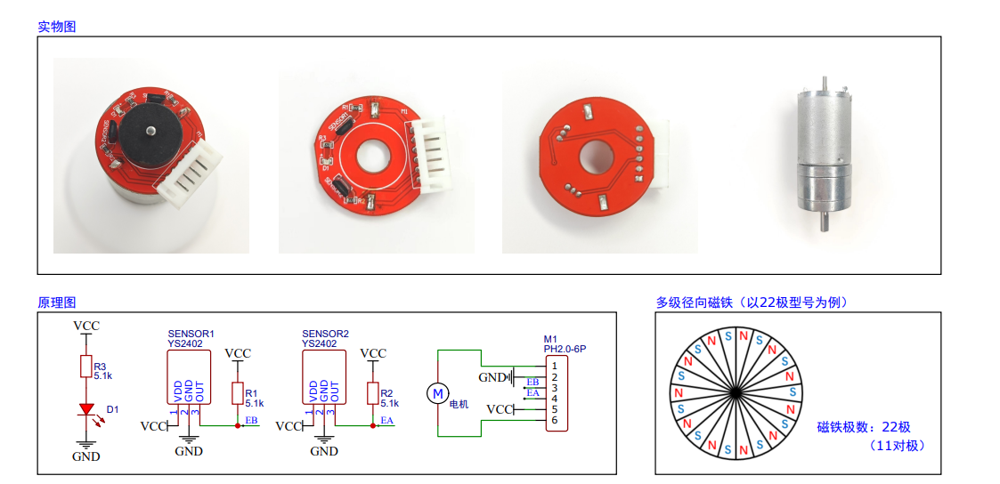
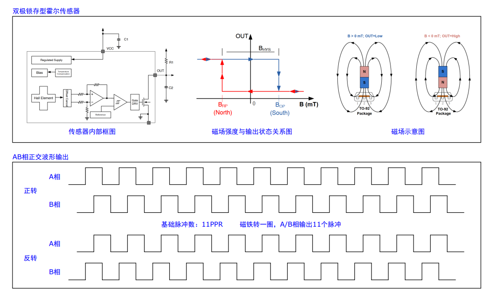
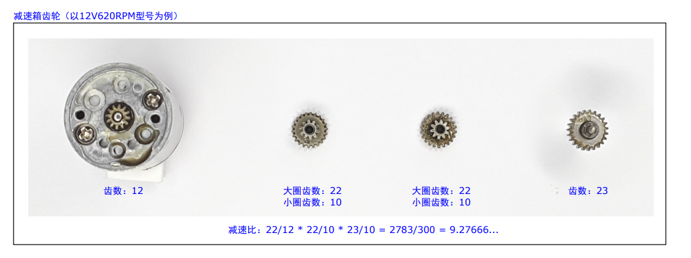
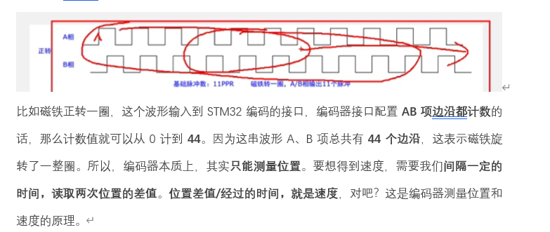
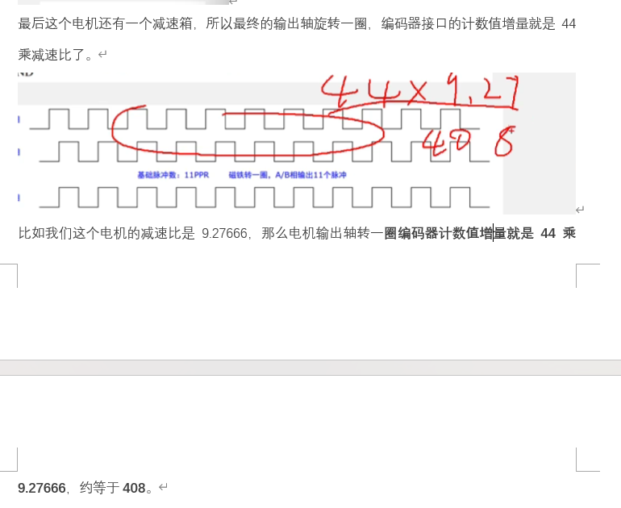

# 霍尔传感器与编码器 —— 学习笔记

> 本笔记记录了霍尔传感器、电机编码器、角度传感器的工作原理及其在 STM32 PID 控制项目中的应用。

---

## 目录

- [一、霍尔传感器详解](#一霍尔传感器详解)
  - [1. 霍尔效应原理](#1-什么是霍尔效应)
  - [2. 传感器结构](#2-霍尔传感器的结构)
  - [3. 传感器分类](#3-霍尔传感器的分类)
  - [4. 编码器中的工作过程](#4-霍尔传感器在电机编码器中的工作过程)
  - [5. 电气特性](#5-霍尔传感器的电气特性)
  - [6. 与其他传感器的对比](#6-霍尔传感器-vs-其他传感器对比)
  - [7. 常见芯片型号](#7-常见的霍尔传感器芯片)
- [二、Q&A 问答记录](#二qa-问答记录)
  - [Q1：两个霍尔传感器如何实现电机测速和测位置？](#q1两个霍尔传感器如何实现电机测速和测位置)
  - [Q2：霍尔编码器与旋转编码器的关系？](#q2霍尔编码器与旋转编码器的关系)
  - [Q3：霍尔传感器能驱动电机正反转吗？](#q3霍尔传感器能驱动电机正反转吗)
  - [Q4：霍尔传感器 + TB6612 能完成闭环控制吗？](#q4霍尔传感器--tb6612-能完成闭环控制吗)
  - [Q5：接霍尔传感器的 MCU 引脚需要设置为输入模式吗？](#q5接霍尔传感器的-mcu-引脚需要设置为输入模式吗)
  - [Q6：角度传感器为什么使用 ADC？](#q6角度传感器为什么使用-adc)
  - [Q7：电机编码器如何读取输出轴的位置和速度？](#q7电机编码器如何读取输出轴的位置和速度)
  - [Q8：电机减速箱的减速比是干嘛的？为什么减速比越小同样 PWM 转得越快？](#q8电机减速箱的减速比是干嘛的为什么减速比越小同样-pwm-转得越快)
  - [为什么输出轴转一圈的编码器计数是 44xR 而不是 44/R？](#为什么输出轴转一圈的编码器计数是-44xr-而不是-44r)
  - [减速比越小输出轴越快，倒立摆响应就越快吗？](#减速比越小输出轴越快倒立摆响应就越快吗)

---

# 一、霍尔传感器详解

## 1. 什么是霍尔效应？

霍尔效应是整个霍尔传感器的物理基础，由美国物理学家 **Edwin Hall** 于 **1879 年**发现。

### 原理

当一块**导体或半导体薄片**中通有电流 $I$，并且在**垂直于电流方向**施加外部磁场 $B$ 时，运动的载流子（电子或空穴）会受到**洛伦兹力**的作用，向薄片的一侧偏转积聚，从而在薄片两侧产生一个**电压差**，即**霍尔电压** $V_H$。

```
          磁场 B（垂直纸面向里）
              ⊗ ⊗ ⊗ ⊗ ⊗

      ┌─────────────────────┐
I →→→ │  电子受洛伦兹力偏转    │ →→→ I
      │    ↓ ↓ ↓ ↓ ↓        │
      └─────────────────────┘
         -  (电子积聚)   +
        ←───── V_H ─────→
            霍尔电压
```

### 霍尔电压公式

$$V_H = \frac{I \cdot B}{n \cdot e \cdot d}$$

| 符号  | 含义         |
| :---: | :----------- |
| $V_H$ | 霍尔电压     |
| $I$   | 通过薄片的电流 |
| $B$   | 外加磁场强度 |
| $n$   | 载流子浓度   |
| $e$   | 电子电荷量   |
| $d$   | 薄片厚度     |

> **关键点**：霍尔电压 $V_H$ 与磁场强度 $B$ 成**正比**。磁场越强，输出电压越大，这是霍尔传感器能"感知"磁场的根本原因。

---

## 2. 霍尔传感器的结构

霍尔传感器本质上是将**霍尔效应元件**与**信号处理电路**集成在一个小芯片中：

```
┌──────────────────────────────────────┐
│            霍尔传感器芯片              │
│                                      │
│  ┌──────────┐   ┌──────────────────┐ │
│  │ 霍尔元件  │──→│ 信号调理电路      │ │
│  │(半导体片) │   │ （放大+施密特触发）│ │
│  └──────────┘   └───────┬──────────┘ │
│                         │            │
│                    ┌────┴────┐       │
│                    │ 输出驱动 │       │
│                    └────┬────┘       │
└─────────────────────────┼────────────┘
                          │
                     输出信号（高/低电平）
```

| 部分           | 功能                                         |
| :------------- | :------------------------------------------- |
| **霍尔元件**   | 半导体薄片，感受磁场产生霍尔电压（通常只有毫伏级） |
| **放大电路**   | 将微弱的霍尔电压放大到可用的电压范围         |
| **施密特触发器** | 将模拟信号转换为干净的数字方波信号（消除抖动） |
| **输出驱动**   | 驱动输出引脚，提供稳定的高低电平             |

---

## 3. 霍尔传感器的分类

### 按输出信号分类

| 类型               | 输出信号           | 特点                           | 典型应用                         |
| :----------------- | :----------------- | :----------------------------- | :------------------------------- |
| **开关型（数字型）** | 高/低电平（方波）  | 只有"有磁场"和"无磁场"两种状态  | 编码器、转速检测、位置开关       |
| **线性型（模拟型）** | 连续变化的模拟电压 | 输出电压与磁场强度成正比       | 电流检测、角度精确测量、位移传感 |

### 按触发方式分类

| 类型       | 工作方式                       | 说明                              |
| :--------- | :----------------------------- | :-------------------------------- |
| **单极型** | 只响应一个极性的磁场（如 S 极） | 南极靠近→输出低，远离→输出高      |
| **双极型** | 响应两个极性的磁场             | S 极靠近→输出低，N 极靠近→输出高  |
| **全极型** | 无论 N 极还是 S 极靠近都触发   | 只关心有没有磁场，不区分极性      |

> **在编码器中**，通常使用**开关型（数字型）**霍尔传感器，因为只需要方波脉冲来计数，不需要模拟量。

---

## 4. 霍尔传感器在电机编码器中的工作过程

### 基本结构

```
    ┌──── 电机轴 ────┐
    │                │
    │   ┌────────┐   │
    │   │ N│ │S  │   │    ← 磁铁（固定在电机轴上，随轴旋转）
    │   └────────┘   │
    │                │
    │     ★    ★     │    ← 两个霍尔传感器（固定在PCB上，不动）
    │    (A)  (B)    │       相隔 90° 电角度安装
    │                │
    └────────────────┘
```

### 工作流程

1. **电机轴旋转** → 带动磁铁旋转
2. **磁铁旋转** → 磁场在霍尔传感器位置周期性变化（N→S→N→S...）
3. **霍尔传感器感知磁场变化** → 输出方波脉冲信号
4. 两个传感器位置错开 → 两路信号相位差 90° → **正交信号**

### 正交信号波形

以电机转一圈为例，磁铁的 N 极和 S 极交替经过传感器：

```
磁铁位置:  N极经过A → N极经过B → S极经过A → S极经过B → (一圈)

传感器A:  ┌───────┐       ┌───────┐
          │       │       │       │
     ─────┘       └───────┘       └─────

传感器B:      ┌───────┐       ┌───────┐
              │       │       │       │
     ─────────┘       └───────┘       └─

              ← 相位差90° →
```

---

## 5. 霍尔传感器的电气特性

### 典型引脚

| 引脚  | 名称     | 说明                                       |
| :---: | :------- | :----------------------------------------- |
| VCC   | 电源     | 通常 3.3V 或 5V                            |
| GND   | 地       | 电源地                                     |
| OUT   | 信号输出 | 方波脉冲信号（开关型）或模拟电压（线性型） |

### 关键参数

| 参数     | 典型值              | 说明                         |
| :------- | :------------------ | :--------------------------- |
| 工作电压 | 3.3V ~ 5V           | 常见供电范围                 |
| 输出类型 | 开漏 / 推挽         | 开漏需要外接上拉电阻         |
| 响应频率 | 几 kHz ~ 几十 kHz   | 决定了能检测的最高转速       |
| 工作温度 | -40°C ~ 125°C       | 适合工业和汽车环境           |

---

## 6. 霍尔传感器 vs 其他传感器对比

| 特性         | 霍尔传感器               | 光电编码器         | 电位器           |
| :----------- | :----------------------- | :----------------- | :--------------- |
| **检测原理** | 磁场                     | 光遮断 / 反射      | 电阻分压         |
| **输出信号** | 数字方波 / 模拟          | 数字方波           | 模拟电压         |
| **精度**     | 中等                     | 高（可达数千线）   | 低 ~ 中          |
| **抗干扰**   | 强（不怕灰尘、油污）     | 弱（怕灰尘遮挡）   | 中               |
| **寿命**     | 极长（无接触、无磨损）   | 长（光电无接触）   | 短（有机械磨损） |
| **成本**     | 低                       | 中 ~ 高            | 低               |
| **体积**     | 小                       | 较大               | 中               |
| **适用场景** | 电机编码器、接近开关     | 高精度伺服系统     | 旋钮、简单角度检测 |

### ✅ 霍尔传感器的优势

- **无接触检测**：不需要物理接触，没有磨损，寿命极长
- **抗恶劣环境**：不怕灰尘、油污、湿气，适合恶劣环境
- **体积小、成本低**：非常适合集成在小型电机中
- **响应速度快**：能检测高速旋转

### ❌ 霍尔传感器的不足

- **精度有限**：一般每转只有几十个脉冲，不如高精度光电编码器
- **受温度影响**：霍尔电压会随温度漂移（高端芯片有温度补偿）
- **受外部磁场干扰**：附近有强磁场源时可能误触发

---

## 7. 常见的霍尔传感器芯片

| 芯片型号           | 类型            | 特点                                 |
| :----------------- | :-------------- | :----------------------------------- |
| **SS41**           | 开关型（单极）  | 常用于编码器，价格便宜               |
| **A3144 / OH3144** | 开关型（单极）  | 经典型号，开漏输出，需上拉电阻       |
| **SS49E**          | 线性型          | 输出模拟电压，适合精确测量磁场强度   |
| **AH3503**         | 线性型          | 灵敏度高，适合角度和位移检测         |
| **AS5600**         | 磁编码器（I2C） | 12位精度，可直接输出角度值           |

---

# 二、Q&A 问答记录

---

## 霍尔编码器与旋转编码器的关系？

> **完全正确！** 霍尔编码器与光电式旋转编码器的输出信号本质相同。

1. **两个霍尔传感器**各自独立输出一路方波脉冲信号（A 相和 B 相）
2. 因为它们在物理上**错开了 90° 安装**，两路信号天然具有 **90° 的相位差**
3. 这和光电式旋转编码器的输出**本质上是一样的**——都是正交脉冲信号

有了两路正交信号：
- **看谁超前谁滞后** → 判断正反转
- **数脉冲个数** → 计算电机的速度与位置

霍尔编码器和光电编码器的区别仅在于**检测原理**（磁场 vs 光），输出的信号形式和使用方式完全相同，STM32 的编码器接口模式可以直接使用。

---

## 霍尔传感器能驱动电机正反转吗？

> **需要澄清**：霍尔传感器本身**不能驱动电机**，它们只负责**感知和反馈**。

两者的分工如下：

| 组件                             | 作用                             |
| :------------------------------- | :------------------------------- |
| **电机驱动电路**（H 桥 / 驱动芯片） | 控制电机正转、反转、调速         |
| **霍尔传感器（编码器）**         | 检测电机当前的转速、方向、位置（转子角度） |

控制电机正反转靠的是 **H 桥电路改变电流方向**，与霍尔传感器无关。但霍尔传感器在闭环控制中非常重要——它提供反馈信号，让 MCU 知道电机"实际转了多少、往哪转"，从而通过 PID 等算法精确控制电机。

| 目标       | 手段               |
| :--------- | :----------------- |
| 驱动电机   | 靠**电机驱动电路** |
| 感知电机状态 | 靠**霍尔传感器** |
| 精确控制   | **两者配合**，形成闭环 |

---

## 霍尔传感器 + TB6612 能完成闭环控制吗？

> **没错！** 这正是一个完整闭环控制系统的硬件基础。

| 组件                         | 负责                                                     |
| :--------------------------- | :------------------------------------------------------- |
| **TB6612**                   | 驱动电机正转/反转/调速（PWM + 方向引脚）                 |
| **两个霍尔传感器（编码器）** | 测量电机的速度和位置（**反馈信号**）                     |
| **STM32**                    | 大脑：读取编码器反馈，通过 PID 算法计算输出，控制 TB6612 |

整个闭环工作流程：

```
STM32 发指令 → TB6612 驱动电机转动
                        ↓
              霍尔传感器检测转动状态
                        ↓
              反馈给 STM32（速度 / 位置）
                        ↓
              STM32 用 PID 调整输出 → 回到第一步
```

> **TB6612 负责"执行"，霍尔编码器负责"反馈"，STM32 负责"决策"。**

---

## 接霍尔传感器的 MCU 引脚需要设置为输入模式吗？

> **没错！** 单片机要**读取**霍尔传感器输出的高低电平，引脚必须配置为**输入模式**。

在 STM32 中有两种常用配置：

| 配置方式                               | 说明                             | 适用场景                                     |
| :------------------------------------- | :------------------------------- | :------------------------------------------- |
| **浮空输入**（GPIO_Mode_IN_FLOATING）  | 引脚电平完全由外部信号决定       | 传感器输出为推挽型，能主动输出高低电平       |
| **上拉输入**（GPIO_Mode_IPU）          | 内部接上拉电阻，默认高电平       | 传感器输出为**开漏型**（如 A3144），需要上拉电阻 |

> **在本项目（编码器应用）中**，引脚被配置为**复用功能输入（GPIO_Mode_AF）**，让定时器硬件自动捕获脉冲计数，不需要软件手动读取电平。

| 使用场景       | 配置方式                           |
| :------------- | :--------------------------------- |
| 普通读取电平   | GPIO 输入模式（浮空 / 上拉）       |
| 编码器计数     | 复用功能模式，交给定时器硬件自动处理 |

两种方式本质都是"输入"，只是后者更高效，不占用 CPU。

---

## 角度传感器为什么使用 ADC？

> [!IMPORTANT]
> **注意区分控制系统中的两个传感器职责**：
> 1. **电机编码器**（接 PA6/PA7）：测量**电机输出轴的位置和速度**，用作电机控制的实际反馈。
> 2. **角度传感器**（接 PB0）：通过 ADC 测量**摆杆的实际倾斜角度**，用作单摆 PID 控制的实际输入值。
>
> 本节讨论的“角度传感器”是专门用于测量**摆杆倾斜角**的传感器，而不是电机编码器。

### 根本原因：传感器输出的是模拟电压

这类角度传感器（如旋转电位器式、磁性模拟角度传感器等）工作原理是将**旋转角度转换成连续变化的模拟电压信号**，而非数字信号：

| 角度   | 输出电压（以 3.3V 供电为例） |
| :----: | :--------------------------: |
| 0°     | 约 0 V                       |
| 180°   | 约 1.65 V                    |
| 360°   | 约 3.3 V                     |
| 中间值 | 对应中间电压（**线性关系**） |

STM32 是数字芯片，**无法直接"理解"连续变化的模拟电压**。必须借助内部的 **ADC（模数转换器）** 将电压值转换为对应的数字量，MCU 才能进行计算。

> **一句话总结**：角度传感器输出模拟电压，STM32 用 ADC 将它转换为数字值，才能读懂它。

### 角度检测完整流程

```
旋转轴转动
    ↓
角度传感器内部产生与角度成比例的模拟电压（0V ~ 3.3V）
    ↓
PB0 引脚（配置为模拟输入 GPIO_Mode_AIN）采集该电压
    ↓
ADC1 通道8 将模拟电压转换为 12 位数字值（0 ~ 4095）
    ↓
MCU 读取数字值，代入换算公式计算出实际角度
```

### ADC 值与角度的换算

STM32 的 ADC 是 **12 位**精度，参考电压为 **3.3V**：

$$\text{AD值} = \frac{V_{out}}{3.3} \times 4095 \qquad V_{out} = \frac{\text{AD值}}{4095} \times 3.3 \, \text{V}$$

以线性传感器、量程 0°~360° 为例：

$$\theta = \frac{\text{AD值}}{4095} \times 360°$$

| AD 值 | 对应电压  | 对应角度 |
| :---: | :-------: | :------: |
| 0     | 0 V       | 0°       |
| 2048  | ~1.65 V   | ~180°    |
| 4095  | 3.3 V     | 360°     |

> **注意**：不同传感器的实际量程和线性度可能有差异，使用前应查阅数据手册，或通过实测两端点电压进行标定。

### 为什么 PB0 必须设为模拟输入（GPIO_Mode_AIN）？

```c
GPIO_InitStructure.GPIO_Mode = GPIO_Mode_AIN; // 模拟输入
GPIO_InitStructure.GPIO_Pin  = GPIO_Pin_0;    // PB0
GPIO_Init(GPIOB, &GPIO_InitStructure);
```

| 引脚模式           | 说明                                                                 |
| :----------------- | :------------------------------------------------------------------- |
| **模拟输入 (AIN)** | 关闭内部施密特触发器和上下拉电阻，引脚直接连通 ADC 采样电路，电压**不失真** |
| 普通数字输入       | 内部施密特触发器会将模拟信号"强行"判定为高/低电平，中间值**完全丢失** |

> 只要引脚被 ADC 使用，**必须**配置为模拟输入模式，否则 ADC 读到的值会是错误的。

### 角度传感器 vs 霍尔编码器

| 对比项       | 角度传感器（ADC 读取）               | 霍尔编码器（定时器读取）           |
| :----------- | :----------------------------------- | :--------------------------------- |
| **输出信号** | 模拟电压（连续）                     | 数字脉冲（离散）                   |
| **MCU 接口** | ADC                                  | 定时器编码器模式                   |
| **测量量**   | **绝对角度**（上电即可知道当前角度） | **相对角度**（需从某一基准点计数） |
| **精度**     | 受 ADC 位数限制（12位→4096级）       | 受编码器分辨率（PPR）限制          |
| **典型应用** | 舵机反馈、旋钮位置检测               | 电机闭环调速、精确定位             |

> **核心区别**：角度传感器测的是**绝对位置**，上电就能直接知道当前角度；霍尔编码器测的是**相对位移**，需要从某个参考点开始计数。

---

## 电机编码器如何读取输出轴的位置和速度？









> 编码器通过**物理信号产生（硬件）**与**脉冲计数处理（软件）**两部分的配合，来获取电机输出轴的位置和速度。

### 一、信号生成（硬件部分）

编码器由**多级径向磁铁（磁环）**和**双极锁存型霍尔传感器**组成：

**① 磁环旋转**
- 磁环固定在**电机的转子轴（即未经过减速箱的电机内轴）**上，随电机高速旋转。
- 以 22 极磁环为例，内部包含 **11 对 N-S 极**。

**② 霍尔元件感应**
- 两个霍尔传感器（如 YS2402）以 $90°$ 电角度错开，安装在电机尾部的固定 PCB 板上。
- 磁环旋转时，N 极和 S 极交替经过传感器，输出高低电平交替的方波信号。
- 磁铁每转一圈，每个传感器输出 **11 个脉冲**（基础脉冲数为 **11 PPR**）。

**③ 产生正交信号**
- 两传感器空间错开，输出的方波波形具有 $90°$ 的相位差（即 **A 相**和 **B 相**正交信号）。

> [!NOTE]
> **🌟 脉冲数量与什么有关？**
> **完全取决于磁铁的磁极对数，与霍尔传感器本身无关。**
> - **霍尔是开关**：霍尔传感器本身（如双极锁存型）只是一个被动的“磁场开关”，它检测到 N 极输出高电平，检测到 S 极输出低电平。
> - **极数定脉冲**：因为磁铁有 22 极（11 对 N-S 极），转一圈 N-S 极交替经过传感器 11 次，才产生 11 个脉冲。如果换成 16 极（8 对 N-S 极）磁铁，输出就是 8 个脉冲。
> - **霍尔的作用**：虽然数量由磁铁决定，但霍尔传感器的**物理安装间距**（错开 $90^\circ$ 电角度）决定了 A/B 两路信号的相位差，这是单片机进行 **4 倍频** 细分的前提。

---

### 二、位置（角度）检测（软件计数部分）

**① 辨识方向**

单片机**硬件自动对比** A、B 两相波形的超前或滞后关系：

| 情况     | A 上升沿时 B 的状态 | 计数器动作 |
| :------- | :-----------------: | :--------: |
| **正转** | B = 低电平          | 计数器 +1  |
| **反转** | B = 高电平          | 计数器 -1  |

**② 四倍频技术**

配置 STM32 编码器模式（`TIM_EncoderMode_TI12`）后，同时捕获 A 相和 B 相的**上升沿和下降沿**，一个脉冲周期细分为 4 个计数单位：

$$\text{转子一圈计数值 (CPR)} = 11 \text{ PPR} \times 4 = 44 \text{ 个计数}$$

**③ 结合减速比折算到输出轴**

编码器装在电机转子（内轴）上，若减速比为 $R$（例如 $9.27666$），则：

$$\text{输出轴一圈计数值} = 44 \times R = 44 \times 9.27666 \approx 408.17 \text{ 个计数}$$

$$\theta_{\text{输出轴}} = \frac{\text{当前计数值}}{\text{输出轴一圈计数值}} \times 360^\circ \quad \text{（表示输出轴旋转位置，常用于电机闭环）}$$

---

### 三、速度检测（M 法 · 测频法）

速度测量采用 **M 法（测频法）**：在固定的时间间隔 $\Delta t$ 内数脉冲个数。

**① 定时采样**

每隔固定时间间隔 $\Delta t$（通常 10ms 或 20ms）调用一次读取函数，获取增量值 $\Delta \text{count}$，并**立即将计数器清零**，准备下一次计数。

**② 计算转速**

$$v_{\text{转子}} = \frac{\Delta \text{count}}{44 \times \Delta t} \quad \text{（圈/秒）}$$

$$v_{\text{输出轴}} = \frac{\Delta \text{count}}{44 \times \Delta t \times R} \quad \text{（圈/秒）}$$

$$\text{输出轴转速 (RPM)} = \frac{\Delta \text{count} \times 60}{44 \times \Delta t \times R}$$

---

### 四、总结

| 测量目标     | 核心方法                                         |
| :----------- | :----------------------------------------------- |
| **位置/电机角度**| 正交脉冲累加（正转 +1，反转 -1），除以输出轴一圈计数值换算位置 |
| **速度**     | 单位时间 $\Delta t$ 内的脉冲增量，除以时间和减速比  |

```
                    【位置获取】
                   累计总计数值 ──→ 除以 (44 × R) ──→ 输出轴位置(电机角度)
                   ▲
                   │ 正转 +1 / 反转 -1
【编码器 A/B 脉冲】──┤
                   │ 定时采集脉冲差值 Δcount
                   ▼
                    【速度获取】
                   单位时间增量 ──→ 除以 (44 × Δt × R) ──→ 输出轴实际速度
```


---

## 为什么输出轴转一圈的编码器计数是 44xR 而不是 44/R？



> **核心关键**：编码器装在**电机内轴（转子）**上，不是输出轴上。它数的是内轴的旋转，不是输出轴的旋转。

### 一、编码器的安装位置

```
【电机转子（内轴）】──→【齿轮减速箱】──→【输出轴（外轴）】
    ↑ 编码器装在这里           ×R 倍减速
    ↑ 转得快，力量小                        转得慢，力量大
```

减速比 $R = 9.27$ 的含义是：

$$\text{内轴转 } 9.27 \text{ 圈} \quad \Longrightarrow \quad \text{输出轴才转 } 1 \text{ 圈}$$

### 二、站在编码器的角度看

编码器只能"看到"内轴的旋转。它不知道外面有没有减速箱，它只忠实地数内轴转了多少：

| 事件               | 内轴转了几圈 | 编码器计了多少数 |
| :----------------- | :----------: | :--------------: |
| 内轴转 **1** 圈    |      1       |       44         |
| 内轴转 **9.27** 圈 |     9.27     | 44 x 9.27 = 408 |

而**输出轴转 1 圈**，恰好就是**内轴转了 $R$ 圈**（因为减速比 $R = 9.27$）。

$$\text{输出轴转 1 圈} \rightarrow \text{内轴转 } R \text{ 圈} \rightarrow \text{编码器计了 } 44 \times R \text{ 个数}$$

### 三、为什么不是 44/R？

"除以减速比"用在**速度换算**场景——减速箱让输出轴转得**更慢**：

$$\text{输出轴转速} = \frac{\text{内轴转速}}{R}$$

但这里问的不是速度，而是**"输出轴转完整一圈时，编码器累计了多少个数"**。输出轴转得慢，意味着它转完一圈需要**更长的时间**，而在这段更长的时间里，内轴实际上**多转了 $R$ 倍**的圈数。编码器跟着内轴数脉冲，自然也数了 $R$ 倍之多。

> **通俗比喻**：用自行车低档（大减速比）骑行时，你的脚（内轴）踩了 $9$ 圈踏板，车轮（输出轴）才转了 $1$ 圈。如果你的脚上绑了一个计数器，车轮转 $1$ 圈时，脚上的计数器已经记了 $9$ 圈——是**乘以**减速比，不是除以。

### 四、总结

| 场景                         | 公式                                              | 乘还是除 | 原因                                                     |
| :--------------------------- | :------------------------------------------------ | :------: | :------------------------------------------------------- |
| 输出轴**转速**               | $v_{\text{out}} = v_{\text{in}} / R$              |  **/ R** | 减速箱让输出轴转得**更慢**                               |
| 输出轴转一圈的**编码器计数** | $\text{count} = 44 \times R$                      |  **x R** | 输出轴转 1 圈，内轴得转 R 圈，编码器跟着数了 R 倍的脉冲 |

---

## 减速比越小输出轴越快，倒立摆响应就越快吗？

### 一、为什么减速比越小，同样 PWM 输出轴转得越快？

直接套公式：

$$\text{输出轴转速} = \frac{\text{内轴转速}}{R}$$

同样的 PWM 意味着内轴转速相同（比如都是 3000 RPM），分母 $R$ 越小，商越大，输出轴越快：

| 减速比   | 内轴转速   | 输出轴转速     |
| :------: | :--------: | :------------: |
| $R = 30$ | 3000 RPM   | **100 RPM**    |
| $R = 10$ | 3000 RPM   | **300 RPM**    |

### 二、输出轴转得越快，倒立摆响应就越快吗？

> **有条件地成立，不能简单画等号。**

倒立摆的"响应速度"取决于两个物理量的**共同作用**：

| 物理量             | 含义                         | 减速比小时       | 减速比大时       |
| :----------------- | :--------------------------- | :--------------: | :--------------: |
| **最高速度**       | 电机能跑多快去"追"摆杆      | 快 ✅            | 慢 ❌            |
| **加速度（扭矩）** | 电机能多快从静止"起步"      | 弱（起步慢）❌   | 强（起步快）✅   |

真正的响应速度 = **起步有多快** x **能跑多快**，两者缺一不可。

> **打个比方**：一辆跑车（小减速比）极速 300km/h，但起步需要 10 秒才能到极速；一辆卡车（大减速比）极速只有 80km/h，但扭矩大、起步猛，1 秒就能到极速。在倒立摆这种需要**几十毫秒内瞬间反应**的场景里，起步加速度往往比最高速度更重要。

### 三、准确结论

| 减速比状态     | 最高速度 | 起步加速度 | 倒立摆实际响应 |
| :------------- | :------: | :--------: | :------------- |
| **适当减小**   | 提高 ✅  | 尚可 ✅    | 响应**上限**变快，系统能应对更大偏角 |
| **过小**       | 很高 ✅  | 太弱 ❌    | 起步慢、带不动，实际响应反而**变差** |
| **过大**       | 太低 ❌  | 很强 ✅    | 起步猛但追不上大偏角，响应**受限** |

- 减速比**适当小** → 输出轴极限速度提高 → 系统速度响应的**天花板**提高 → 响应上限变快 ✅
- 减速比**过小** → 扭矩不够 → 起步加速太慢 → 实际响应反而**变差** ❌
- 最佳选择是在 $1:10 \sim 1:30$ 之间找到**速度与扭矩的平衡点**
