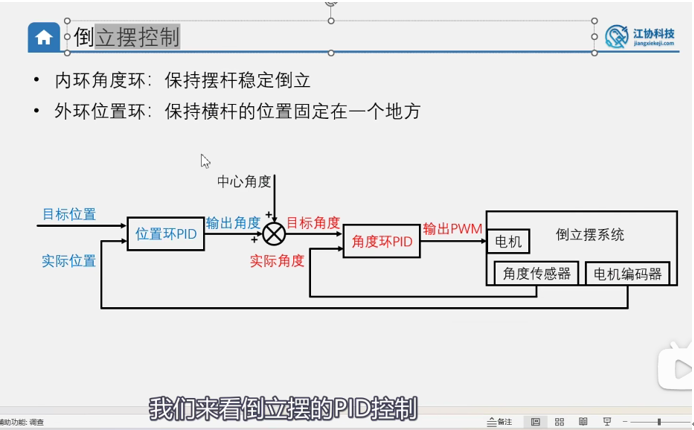
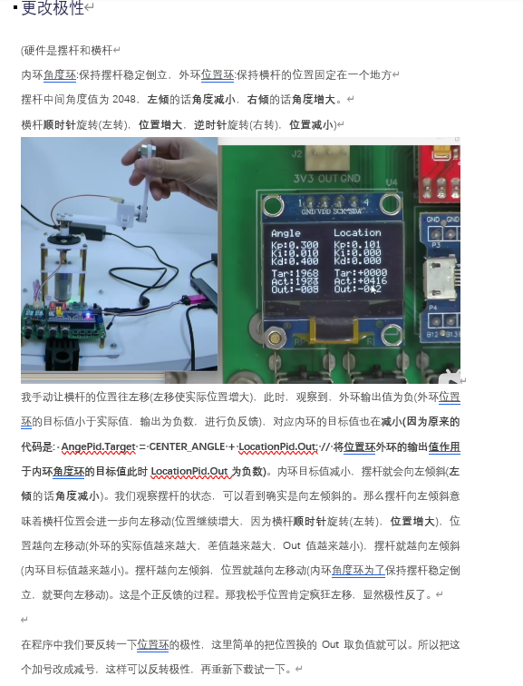
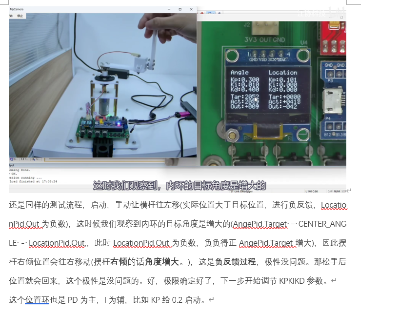

# 倒立摆串级PID常见问题

## 为什么外环（位置环）的输出作为内环（角度环）的输入时，需要加上中心角度？

### 核心原因：两个环的"零点"不一样

#### 1. 角度环的"平衡点"不是 0，而是 2048

角度传感器输出范围大约是 0~4095（12 位 ADC）。摆杆竖直朝上（平衡位置）时，传感器读数是 **2048**，而不是 0。

所以角度环的目标值必须是 **2048** 才能让摆杆保持竖直。

#### 2. 位置环的输出代表"需要多大的角度偏移"

位置环的逻辑是：

- 位置偏了 → 输出一个修正量 → 告诉角度环"你得往某个方向倾斜一点"

但位置环输出的是一个**相对修正量**（比如 +10 或 -15），它的含义是"在竖直的基础上偏多少"。

#### 3. 如果不加 CENTER_ANGLE 会怎样？

假设不加中心角度，直接写：

```c
AngePid.Target = LocationPid.Out;  // ❌ 错误！
```

当位置环输出为 0（位置刚好到位，不需要修正）时：

- `AngePid.Target = 0`
- 角度环认为目标角度是 **0**（完全倒下的一端）
- 摆杆会直接倒下！💥

#### 4. 加上 CENTER_ANGLE 才是正确的

```c
AngePid.Target = CENTER_ANGLE - LocationPid.Out;  // ✅ 正确
```

| 位置环输出 | 角度环目标值        | 物理含义                                   |
| :--------: | :-----------------: | :----------------------------------------- |
|    `0`     | `2048 + 0 = 2048`  | 位置到位，保持竖直 ✅                       |
|   `+10`    | `2048 - 10 = 2038` | 位置偏了，稍微往一侧倾斜来修正位置         |
|   `-10`    | `2048 + 10 = 2058` | 位置偏了，稍微往另一侧倾斜来修正位置       |

#### 一句话总结

> **`CENTER_ANGLE` 是角度环的"基准工作点"。** 位置环的输出只是一个微小的偏移修正量，必须叠加在这个基准上，角度环才知道"在竖直平衡的基础上偏多少"。没有这个基准，角度环就会把目标理解成一个荒谬的绝对角度，摆杆直接失控。

本质上，这就是**串级 PID 中"外环输出 = 内环设定值"时，必须考虑内环基准偏置**的通用原则。

---

## 为什么是 `CENTER_ANGLE - LocationPid.Out`（减），而不是 `CENTER_ANGLE + LocationPid.Out`（加）？

### 答案：这纯粹是硬件极性问题

代码中的注释已经说明了：

```c
// 原始版本（被注释掉，用的是 +）
// AngePid.Target = CENTER_ANGLE + LocationPid.Out;

// 实际使用的版本（用的是 -）
/*调整极性*/
AngePid.Target = CENTER_ANGLE - LocationPid.Out;
```

**原本写的就是 `+`，调试时发现极性反了（系统发散），才改成了 `-`。**

### 推理分析

一种常见的直觉推理是：

> 目标位置 +100 → 位置环输出为正 → 加上 2048 得到 2148 → 角度 > 2048 → 摆杆右倾 → 车往右走 ✅

这个推理**成立的前提**是：角度传感器读数增大 = 物理上往右倾。

但在实际硬件中，很可能是**反过来的**：

| 角度读数   | 实际物理方向     |
| :--------: | :--------------: |
| **> 2048** | 摆杆往**左**倾   |
| **< 2048** | 摆杆往**右**倾   |

如果是这种安装方向，那推理就变成了：

> 想让车往右走 → 需要摆杆右倾 → 需要角度 **< 2048** → 应该用 `2048 - 正数` → 用减法 ✅

### 怎么判断该用 `+` 还是 `-`？

这不是理论推导能确定的，**取决于三个硬件方向的组合**：

1. **角度传感器的安装方向** — 顺时针/逆时针哪个方向读数增大？
2. **编码器的计数方向** — 车往右走时 `Speed` 是正还是负？
3. **电机的转向** — 正 PWM 驱动车往左还是往右？

这三者中任意一个方向反了，最终的 `+` / `-` 就要跟着翻转。所以代码里标注了 `/*调整极性*/`，意思就是"这个符号是调试出来的，不是推导出来的"。

### 一句话总结

> 用 `+` 还是 `-`，取决于传感器和电机的**物理安装方向**。推理逻辑没问题，只是"角度增大 = 右倾"的假设和实际硬件方向刚好相反。代码原本确实写的 `+`，调试发现反了才改成 `-`。

---

## PWM 是怎么调控倒立摆角度的？为什么"摆杆往哪边倒，车就往哪边追"？



### 先纠正一个常见误解：电机不直接转摆杆，而是移动"底座"

摆杆是被动的——它只是铰接在底座上、自由摆动，电机碰不到它。电机驱动的是轮子/小车（底座）。控制链路是：

> PWM → 电机转 → **底座移动** → 底座通过铰链"顶"摆杆 → 摆杆角度被改变

你不能直接命令摆杆"转到 2048"，只能移动底座，靠物理（惯性 + 重力）让摆杆自己回到直立。这正是倒立摆必须用反馈控制的原因——`Motor_SetPWM` 输出的不是"角度"，而是"底座往哪边跑、跑多快"。

### 再纠正一个术语：变化的是"实际角度"，不是"目标角度"

单独整定内环时，`AngePid.Target` **恒等于 2048，永远不变**。真正变化的是反馈值 `Angle`。这个区分很重要，因为 PID 算的是 `目标 - 实际`，搞反了就理解不了误差符号。

### 沿着代码把方向链路走一遍

假设"角度读数增大 = 往右偏"（这个对应关系取决于角度传感器安装方向，和前文关于极性方向的讨论同理）：

| 环节      | 量                    | 符号     |
| :-------: | :-------------------- | :------: |
| 摆杆往右偏 | `Angle` 从 2048 ↑     | > 2048   |
| 误差      | `Error0 = 2048 - Angle` | **负**   |
| PID 输出  | `Out = Kp·Error0`（Kp>0） | **负**   |
| 电机      | `Motor_SetPWM(负)` → PB12高/PB13低 → 反转 | 反转 |

至于"反转"到底对应底座往左还是往右跑，**取决于电机接线**，代码里看不出来，是调试出来的（就是前文提到的 `/*调整极性*/`）。但因为系统实测能稳住，说明这条链路的最终效果是：**摆杆往哪边倒，底座就往哪边追**。

### 物理原理：底座要往"倾倒方向"加速，才能把摆杆顶回去

这就是"踏板接人"类比的核心。摆杆往右倒（重心在支点右侧），底座必须往右加速，把支点"送到重心正下方"。在底座（加速参考系）里看，底座往右加速相当于给摆杆重心一个向左的惯性力，这个力对支点产生一个把摆杆往回掰的力矩 → 摆杆被推回直立。

反过来，要是底座往**反方向**跑（往左），就等于把支点从重心底下抽走，摆杆倒得更快 → **正反馈 → 发散**。这就是为什么极性接反系统会瞬间失控（呼应前文关于 `+` / `-` 极性的讨论）。

### 三个电位器各自的物理含义

| 参数 | 物理含义                                                              | 调试手感                          |
| :--: | :-------------------------------------------------------------------- | :-------------------------------- |
| **Kp** | "接人的力气大小"——偏了多少，就用力追多少                              | 太小立不住，太大会抖              |
| **Kd** | "预判/刹车"——对角度**变化速率**反应，摆杆刚开始倒就提前发力           | 没有它会左右猛摆，加上就顺；对"顺不顺"影响最大 |
| **Ki** | 内环纯平衡时一般保持 0——积分会累积误差导致慢慢漂走                    | 主要给外环位置环消除稳态偏差用，内环不需要 |

### 一句话总结

> 摆杆往哪边倒，内环就让底座往**同一边**加速去"接住"它：Kp 提供接的力度、Kd 提供预判和阻尼，把摆杆摁回 2048 直立点。方向接反就发散——极性调试的全部意义就在于此。

---

## 单 P 控制时，为什么 Kp 升到 0.22 以上就出现抖动？

### 核心原因：P 项只提供"刚度"，不提供"阻尼"

摆杆被重力 destabilize（天生要倒）。P 项相当于给摆杆装了一根"虚拟弹簧"，把它往直立点（2048）拉——只要弹簧够硬（Kp 够大），就能抵消重力，让杆子不倒。但弹簧本身不消耗能量，**P 项没有任何阻尼作用**。

所以闭环之后，摆杆的运动方程本质上是一个**无阻尼二阶振荡器**：

> 偏一点 → 弹簧拉回 → 冲过直立点 → 往另一边偏 → 再拉回……

Kp 越高：
- 虚拟弹簧越硬 → 来回荡的频率越高（动作越急）；
- 环路增益越大 → 把下面那些**真实存在的滞后**变成了"往系统里灌能量"的通道，把欠阻尼的来回荡推成持续、甚至越抖越大的振荡。

到 Kp ≈ 0.22 时，环路相位裕度被吃光，系统正好卡在稳定边界 → 你看到的抖动。**这个点就是经典整定法（Ziegler-Nichols）里的"临界增益 Ku"。**

### 为什么这个系统一定有滞后

- **5ms 离散采样**：角度环每 5ms 才更新一次输出，控制不是连续的，这是固有相位滞后。
- **电机 + 车体惯性**：给了 PWM，车不会瞬间到位，有机械时间常数。
- 高 Kp × 这两个滞后 = 相位裕度被快速消耗。

### 还有几个被高 Kp 放大的现实因素

- **ADC 噪声**：角度读数本身有几 LSB 的跳动，P 直接乘上去 → 输出跟着跳。Kp 越大，噪声放大越狠。
- **输出量化**：`Motor_SetPWM` 是 `int8_t`（-100~100 的整数），小信号被截断成 ±1、0 的阶跃 → 电机一顿一顿。
- **机械静摩擦/间隙**：很小的修正被摩擦"卡住"，误差累积到一定程度再"挣脱" → 极限环式的来回抖（stick-slip）。

### 怎么解决（标准整定路径）

1. 把 0.22 当成 Ku（临界增益）。
2. Kp 退回到约 0.6~0.8 倍 Ku，即 **~0.15~0.18**。
3. 慢慢加 **Kd**——Kd 就是那个缺的"阻尼器"，它对角度**变化率**反应，专门吸收振荡能量。加到抖动消失、响应变干脆为止。
4. Ki 内环保持 0。

这正好解释了为什么原来 `Kp=0.1 配 Kd=0.2` 能稳住：Kd 补上了 P 缺的那份阻尼。如果能量出 0.22 附近抖动的周期 Tu，还可以用 ZN 经验式估个起点：`Kd ≈ Kp·Tu / (8·采样周期)`，`Kp ≈ 0.6·Ku`——算出来多半就在 0.2 上下，和原来的值对得上。

### 一句话总结

> P 单独跑 = 用弹簧拉住一根要倒的杆、却不装阻尼器，杆必然在直立点两侧来回荡；Kp 越高荡得越急，到 0.22 相位裕度耗尽就成了持续抖动。解药是 Kd——它是那个缺的阻尼器。

---

## 单独内环调控时，Kp=0.2、Ki=0、Kd=0.4 摆杆短时间平衡后就倒了，加入 Ki=0.01 后却能长时间稳住，为什么？

### 核心原因：`CENTER_ANGLE = 2048` 不是真正的物理平衡点，纯 PD 无法消除这个稳态偏差

#### 1. 真实平衡点 ≠ 2048

代码中硬编码了 `CENTER_ANGLE = 2048`，但摆杆真正的竖直平衡点在传感器上的读数**几乎不可能恰好是 2048**。原因包括：

- 角度传感器安装时存在微小的机械偏差
- 摆杆本身的重心不完全对称
- 导轨可能有极细微的倾斜

假设真正的物理平衡点在 **2045**（仅差 3 个 LSB，肉眼完全看不出来）。

#### 2. 纯 PD 控制为什么会"慢慢倒"？

| 时间   | 发生了什么                                                   | 结果                                     |
| :----: | :----------------------------------------------------------- | :--------------------------------------- |
| 初始   | 摆杆被扶到接近竖直，传感器读数 ≈ 2045（真正平衡点）          | 误差 = 2048 - 2045 = **+3**              |
| 持续   | P 项输出 = 0.2 × 3 = **0.6**，D 项 ≈ 0（角度没在变）        | 电机以**恒定小转速**持续驱动小车          |
| 后果   | 小车**单方向缓慢漂移**（被这个 0.6 的恒定输出持续推着走）    | 越走越远                                 |
| 最终   | 小车漂到轨道尽头，或漂移速度导致摆杆跟不上                   | 摆杆倒下 💥                              |

**关键点**：P 项对一个**恒定的 3 LSB 偏差**产生恒定输出，D 项对此无能为力（因为误差没有在变化）。这个恒定输出等于给小车一个**持续不断的推力**，小车就像被人轻轻推着一样，越走越远，最终失控。

这不是"平衡不住"，而是**"平衡着但在漂走"**——观察到的"短时间能稳住然后倒了"正是这个现象。

#### 3. 加入 Ki=0.01 为什么就稳住了？

积分项的作用是**自动找到真正的平衡点**。即使 Ki 只有 0.01，给它足够的时间，积分量就能**攒到足以抵消 P 项因中心偏差产生的那个恒定输出**：

| 周期数（每 5ms 一次） | `ErrorInt` 累加值 | Ki × ErrorInt 的输出 |
| :--------------------: | :---------------: | :------------------: |
| 第 1 次                | 3                 | 0.01 × 3 = 0.03     |
| 第 10 次               | 30                | 0.01 × 30 = 0.3     |
| 第 100 次（0.5 秒）    | 300               | 0.01 × 300 = 3.0    |

在真正的平衡状态下，PID 总输出应该为 0（不推小车），这要求：

> Kp × e + Ki × ∫e dt = 0

积分项会自动调整到 `∫e dt = -(Kp / Ki) × e`，恰好抵消 P 项因中心偏差产生的恒定输出。小车不再被持续推着走，漂移消失。

#### 4. 为什么 Ki 只需要 0.01 这么小？

因为需要补偿的偏差本身就**非常微小**（只有几个 LSB）。Ki 的大小决定补偿的速度：

- **Ki = 0.01**：积分累积慢，温和地"找到"真实平衡点，不容易引发振荡 ✅
- **Ki = 0.1**：积分累积快 10 倍，补偿速度快但容易过冲和来回荡，在内环角度控制中反而可能有害 ⚠️

0.01 恰好是个好选择——刚好够消除那个微小的稳态偏差，又不会因为积分太猛而引入新的振荡。

#### 5. 和"内环 Ki 一般保持 0"的建议是否矛盾？

不矛盾。前文说"Ki 内环保持 0"的前提是**有外环位置环在工作**——外环会负责修正小车的漂移。但**单独跑内环、没有外环**时，没有任何东西来管小车的位置，内环的 Ki 实际上**部分替代了外环的角色**，通过积分补偿来抑制小车漂移。
等外环加上之后，内环的 Ki 应该回到 0，让位置环来干消除稳态偏差这件事。

### 一句话总结

> `CENTER_ANGLE = 2048` 和真实物理平衡点之间哪怕只差几个 LSB，纯 PD 控制就会产生一个恒定的"推力"让小车慢慢漂走直到失控。Ki 的作用是自动积累并补偿这个微小偏差，让系统找到真正的零点，小车不再漂移。这本质上就是 I 项"消除稳态误差"的经典作用——只是在有外环时，这个活由位置环干；没有外环时，内环的 Ki 被迫自己来干。

---

## 项目代码中，为什么编码器得到的 CNT 值可以直接看作速度？

### 核心原因：时间是固定的常数，脉冲数直接反映了单位时间内的位移

#### 1. 速度的物理定义
在物理学中，速度的计算公式为：
$$\text{速度} = \frac{\text{位移}}{\text{时间}}$$

#### 2. 定时采样机制（固定分母）
在单片机程序中，`Encoder_Get()` 是在定时器中断（如 1ms 或 5ms）里被**周期性调用**的。因为每次读取的时间间隔（$t$）是完全相同且固定的常数，所以：
$$\text{速度} \propto \text{该时间段内转过的距离（脉冲数）}$$

#### 3. 脉冲数代表位移量（变分子）
当电机转动时，编码器会产生电脉冲。电机转得越快，相同时间内产生的脉冲就越多。
* 定时器的计数器（CNT）在默默累加这些脉冲。
* 我们在 `Encoder_Get()` 里读取当前 CNT 值，并**立刻将计数器清零**。
* 这样，每次读出来的 `Temp` 值就是**“在这固定的采样周期内，编码器产生的新脉冲个数”**。

#### 一句话总结
> 因为采样时间间隔是固定不变的，所以在这个时间段内累积的脉冲个数（CNT 差值）直接与电机的旋转速度成正比。在 PID 计算中，直接拿这个 CNT 值作为速度的反馈值，不仅控制效果等效，还能省去浮点数除法计算。

---

## 霍尔传感器是间隔 90° 摆放，旋转时是圆周运动，这与现实中跑步或汽车的速度有什么区别？该如何理解和换算？

### 核心解答：本质完全一样，只是测量的“单位（尺子）”不同，两者可以通过物理参数互相换算

#### 1. 物理本质的对比

| 特性 | 现实中的速度（跑步/汽车） | 倒立摆代码中的速度 |
| :--- | :--- | :--- |
| **距离的单位** | **米 (m)** 或 **千米 (km)** | **脉冲个数 (Pulses)** |
| **时间的单位** | **秒 (s)** 或 **小时 (h)** | **单片机采样周期（如 5毫秒）** |
| **速度的单位** | **米/秒 (m/s)** 或 **公里/小时 (km/h)** | **脉冲数/5毫秒 (Pulses/5ms)** |

#### 2. 霍尔传感器是如何将“圆周运动”转化为“脉冲计数”的？
- **多级径向磁铁**：电机的轴上装有一个圆形磁环，边缘交替排列着许多对 N 极和 S 极（例如 22 极磁铁，共 11 对极）。
- **信号转化**：两个不动的霍尔传感器贴近磁环。当磁环随电机旋转时，N/S 极交替扫过传感器，传感器输出高低电平跳变的方波脉冲。磁环转完完整的一圈（$360^\circ$ 圆周运动），输出的脉冲个数是绝对固定的（例如 11 个脉冲）。
- **90° 摆放的作用**：如果只放一个传感器，只能测速，无法辨别方向。两个传感器在空间上错开摆放（对应电信号上的 90° 相位差），使得正转时 A 相超前 B 相，反转时 B 相超前 A 相。STM32 的编码器接口据此自动决定 CNT 的加减，从而同时获取速度的大小与方向。

#### 3. 它们之间如何换算？
小车在轨道上的直线运动速度与电机的旋转速度通过机械结构绑定：
$$\text{小车直线速度} = \text{轮子角速度（转速）} \times \text{轮子半径}$$

**换算示例**：
假设小车在 5ms 采样周期内读到的 CNT 值为 **10**，且已知：
- 电机转一圈，编码器产生 **44** 个计数（11对磁极 × 4倍频）。
- 减速箱减速比为 **9.28**。
- 轮子周长为 **0.2** 米。

1. **电机圈数**：$10 \div 44 \approx 0.227$ 圈。
2. **轮子圈数**：$0.227 \div 9.28 \approx 0.024$ 圈。
3. **小车直线位移**：$0.024 \times 0.2 \approx 0.0048$ 米（4.8 毫米）。
4. **小车真实速度**：$0.0048 \text{ 米} \div 0.005 \text{ 秒} \approx 0.96 \text{ 米/秒}$（约合 $3.5$ 公里/小时）。

#### 4. 为什么代码里不直接使用“米/秒”？
- **节省算力**：单片机进行浮点数（小数）乘除法极其消耗 CPU 资源。
- **PID 控制的核心**：PID 算法只关心目标与反馈的“偏差”。我们直接以“脉冲/周期”为单位设计目标值和测量值，与换算后再做 PID 的控制效果完全一致。

#### 一句话总结
> 电机圆周运动的快慢通过磁极扫过传感器的频率被切分成了电脉冲数。在固定的采样周期内，脉冲计数（CNT值）与小车的物理速度是严格的线性比例关系。为了节省单片机算力，代码直接用脉冲计数代表速度。

---

## 为什么 `CENTER_ANGLE + LocationPid.Out` 是正反馈，而 `CENTER_ANGLE - LocationPid.Out` 是负反馈？

### 硬件方向前提

本系统为旋转倒立摆，由**横杆**（电机驱动旋转）和**摆杆**（铰接在横杆端部，自由摆动）组成。

硬件是摆杆和横杆，内环角度环:保持摆杆**稳定倒立**，外环位置环:保持横杆的**位置固定在一个地方**

摆杆中间角度值为2048，**左倾**的话**角度减小**，**右倾**的话**角度增大**。

横杆**顺时针**旋转(左转)，**位置增大**，**逆时针**旋转(右转)，**位置减小**

| 物理事件 | 方向 |
| :--- | :--- |
| 摆杆**左倾** | 角度**减小**（< 2048） |
| 摆杆**右倾** | 角度**增大**（> 2048） |
| 横杆**顺时针**旋转（**左转**） | 位置**增大** |
| 横杆**逆时针**旋转（**右转**） | 位置**减小** |

### 第一步：从角度环的稳定性反推电机方向

角度环代码逻辑：

```c
Error = Target - Actual = 2048 - Angle
Out = Kp × Error
Motor_SetPWM(Out)
```

- 摆杆**右倾** → Angle > 2048 → Error **为负** → PWM **为负**
- 摆杆**左倾** → Angle < 2048 → Error **为正** → PWM **为正**

再结合减法已验证能实现负反馈这一事实，可以反推出电机方向：

| PWM 正负 | 横杆旋转方向 | 位置变化 |
| :---: | :---: | :---: |
| **正 PWM** | **逆时针**（右转） | 位置**减小** |
| **负 PWM** | **顺时针**（左转） | 位置**增大** |

> 也就是说：摆杆右倾时，PWM 为负，横杆顺时针左转。在旋转倒立摆中，这通过转动耦合力矩的作用，能把摆杆推回竖直——这是系统稳定运行的物理基础。

### 第二步：理解一个关键的反直觉现象

当角度环收到一个"右倾目标"（Target > 2048）时，角度环实际驱动横杆的方向是：

- Target = 2068（右倾目标），当前摆杆在 2048（竖直）
- Error = 2068 - 2048 = **+20** → PWM **为正** → 横杆**逆时针右转**

**角度环为了让摆杆往右倾，实际上驱动横杆往右转（逆时针）**。通过旋转耦合，横杆的加速运动会把摆杆甩向目标角度。

| 角度目标 | 角度环驱动横杆方向 | 位置变化 |
| :---: | :---: | :---: |
| **> 2048**（右倾目标） | 逆时针右转 | 位置**减小** |
| **< 2048**（左倾目标） | 顺时针左转 | 位置**增大** |

### 第三步：实战推演——横杆位置偏大

假设横杆顺时针转多了，位置偏大：`Location = +100`（目标是 0）。

#### 位置环计算

误差 = 0 - (+100) = -100

LocationPid.Out = Kp × (-100) = **-20**（负数）

#### 期望的修正方向

位置偏大（+100），需要减小回 0 → 横杆需**逆时针右转**（位置减小方向）。

#### ✅ 减法：`Target = 2048 - (-20) = 2068`

| 环节 | 过程 |
| :--- | :--- |
| **角度目标** | 2068 > 2048 → 右倾目标 |
| **角度环计算** | 误差 = 2068 - 2048 = **+20** → PWM **为正** |
| **电机响应** | 正 PWM → 横杆**逆时针右转** → 位置**减小** |
| **最终效果** | 位置从 +100 减小，朝 0 回归 → **负反馈 ✅** |

#### ❌ 加法：`Target = 2048 + (-20) = 2028`

| 环节 | 过程 |
| :--- | :--- |
| **角度目标** | 2028 < 2048 → 左倾目标 |
| **角度环计算** | 误差 = 2028 - 2048 = **-20** → PWM **为负** |
| **电机响应** | 负 PWM → 横杆**顺时针左转** → 位置**增大** |
| **最终效果** | 位置从 +100 继续增大，越跑越远 → **正反馈 ❌** |

### 一句话总结

> 在本系统的硬件极性下，正 PWM 驱动横杆逆时针右转（位置减小），负 PWM 驱动横杆顺时针左转（位置增大）。当位置偏大需要减小时，位置环输出为负值。**减法**把负值翻正（负负得正），使角度目标 > 2048，角度环输出正 PWM，横杆逆时针右转回来——负反馈。**加法**让角度目标 < 2048，角度环输出负 PWM，横杆反而顺时针左转跑得更远——正反馈。


### 江科大的讲解





---

## 外环使用 PD 控制（P=0.4, D=4），横杆在目标位置附近一直抖动，实际位置和目标位置不能吻合，是什么原因？

### 两个独立的问题

#### 问题一：横杆一直在抖动 — D 值过大，放大了编码器的测量噪声

D/P 比值高达 10 倍（D=4, P=0.4）。位置环的 D 项本质上是在计算位置变化的速率（即速度）：

$$D\text{项输出} = K_d \times (Error_0 - Error_1) \approx -K_d \times Speed$$

而编码器读出来的 `Speed` 值天生就有**量化跳动**——在横杆几乎静止时，`Speed` 会在 `0`、`+1`、`-1` 之间来回跳：

| 采样周期 | Speed 实际读数 | D 项输出（Kd=4） |
| :---: | :---: | :---: |
| 第 1 次 | 0 | 0 |
| 第 2 次 | +1 | **-4** |
| 第 3 次 | 0 | **+4** |
| 第 4 次 | -1 | **+4** |

横杆明明几乎没动，D 项却在 **-4 和 +4 之间疯狂跳动**，这个跳动经过角度环传导给电机，横杆就不停地抖。

**解决方法**：降低 Kd，试 `Kd = 1.0 ~ 2.0`，在保留阻尼效果的同时降低噪声放大。

#### 问题二：实际位置和目标位置不能精确吻合 — 没有 Ki，PD 控制无法消除稳态误差

| 阶段 | 发生了什么 |
| :--- | :--- |
| 初始 | 横杆离目标差 50，P 项输出 = 0.4 × 50 = **20**，横杆快速修正 |
| 中期 | 误差只剩 5，P 项输出 = 0.4 × 5 = **2** |
| **卡住** | 误差只剩 2，P 项输出 = 0.4 × 2 = **0.8**，**不够克服静摩擦力** → 横杆不动 |

D 项在横杆不动时输出为 0，帮不上忙。只有加入 **Ki（建议 0.001 ~ 0.01）**，让积分项慢慢累加残余误差，最终攒到足以克服摩擦力，把横杆推到精确的目标位置。

### 调参建议

| 参数 | 当前值 | 建议调整 | 原因 |
| :---: | :---: | :---: | :--- |
| **Kp** | 0.4 | 保持不变 | 基本修正力度合理 |
| **Kd** | 4.0 | **降到 1.0 ~ 2.0** | 抑制噪声引起的抖动 |
| **Ki** | 0 | **加 0.001 ~ 0.01** | 消除摩擦导致的稳态误差 |

调试顺序：先降 Kd 把抖动消掉，再慢慢加 Ki 直到位置能精确到位。

---

## 为什么调整角度目标值（如改到 2000）后，表现和之前差不多，只是误差从 ±10 变成了 ±15？

### 核心原因：抖动来自 D 项放大编码器噪声，与目标值无关

编码器的量化噪声（Speed 在 0、±1 之间跳动）是**硬件固有特性**，和设什么目标值完全无关。抖动幅度近似为：

$$\text{抖动幅度} \approx \frac{K_d \times \text{编码器噪声幅度}}{K_p}$$

这个公式里**没有目标值**这个变量，所以不管目标设成 2048 还是 2000，抖动的量级都差不多。

### 为什么从 ±10 略微增大到 ±15？

目标改为 2000 时，摆杆不再是竖直的，而是倾斜的。此时重力在"帮倒忙"，控制系统需要更吃力地工作才能维持平衡。在这个更不利的工作点上，同样的噪声会引起**稍大一点的振荡**——但本质上还是同一个 D 项噪声问题。

### 这说明参数调得好吗？

- ✅ **P = 0.4 调得不错**：换了目标后系统能跟过去，误差量级相近，说明比例增益合理。
- ❌ **D = 4 调得过大**：不管什么目标都在抖，说明 D 在持续制造问题。真正调好的系统，横杆应该**安安静静停住**，而不是"在 ±10~15 内来回晃"。

**解决方法不变**：把 Kd 从 4 降到 **1.0 ~ 2.0**，消除抖动。

---

## 如何理解倒立摆中“直接控制”与“间接控制”的关系？角度传感器和电机在其中扮演了什么角色？

### 核心观点：倒立摆是一个“欠驱动系统”，所有控制最终都是通过驱动电机改变横杆位置，来间接影响摆杆角度的

#### 1. 电机与传感器的分工
* **电机（执行机构）**：只能直接驱动横杆（小车底座）运动，改变横杆的位置、速度或加速度。电机无法直接对摆杆施加旋转力矩。
* **角度传感器（检测机构）**：只负责测量摆杆的当前倾角，并反馈给控制器，它自身没有物理出力来扶正摆杆。

#### 2. 内环（角度环）的“间接控角”逻辑（手心立木棍类比）
当只有角度环工作时：
* 摆杆往右倒（角度传感器检测到偏离平衡点） $\rightarrow$ 控制器输出信号驱动电机 $\rightarrow$ **横杆快速往右移动**（去“接”摆杆）。
* 横杆往右移动时，摆杆底端被带向右侧，而摆杆顶端由于惯性滞后，重力矩和惯性力相互作用，摆杆被间接“顶”回直立状态。
* **结论**：角度环是利用横杆的**快速运动（加速度和惯性）**来间接维持摆杆直立的。

#### 3. 外环（位置环）的“间接控位”逻辑（引力拉回类比）
当引入位置环后：
* 如果横杆偏右了，需要往左移。由于不能直接生硬地往左拉（否则摆杆会因惯性向右倾倒），位置环采取“隔山打牛”的做法：给内环角度环下达一个“往左倾斜一点”的目标（比如让目标值偏离 2048）。
* 内环角度环为了达到这个倾斜目标，就会通过电机控制横杆，让摆杆保持“向左微倾”的姿态。
* 一旦摆杆向左倾斜，其重力重心偏左，小车为了不让它倒下，就必须跟着摆杆一路向左移动去接它。
* **结论**：位置环是利用摆杆的**主动倾斜（重力）**来间接把横杆“拉”回目标位置的。

#### 一句话总结
> 倒立摆中只有电机一个动力源。角度环利用横杆的**惯性**来间接稳定摆杆角度，而位置环则利用摆杆的**重力倾角**来间接控制横杆位置。

---
