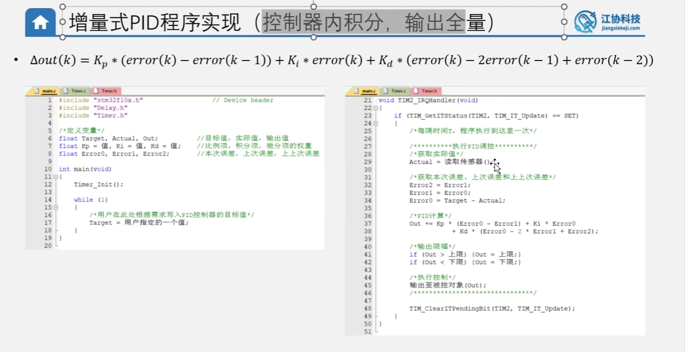
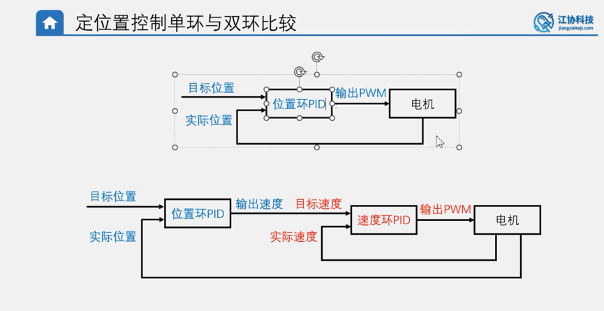

# PID 控制学习疑问汇总

> 本文档记录了在学习 PID 控制算法过程中产生的核心疑问及详细解答。
> 知识来源：江协科技 PID 控制系列课程 + 个人理解整理。

---

## 目录

1. [疑问一：为什么高级优化方案多用在"位置式 PID + 定位置控制"中？](#疑问一)
2. [疑问二：什么是开环控制与闭环控制？单环与双环控制有什么区别？](#疑问二)

---

<a id="疑问一"></a>
# 疑问一：为什么高级优化方案多用在"位置式 PID + 定位置控制"中？

## 我的疑问

我现在有一个很大的疑问，就是为什么**积分分离**、**变速积分**、**微分先行**、**不完全微分**、**输出偏移**、**输入死区**，都是运用在**位置式 PID** 之中，且都是**定位置控制**？增量式 PID 和定速控制不会运用上述的方案吗？

---

## 核心回答：物理场景与算法基因共同决定 🧬

这个疑问非常有深度！能把这些离散的知识点串联起来进行对比，说明你已经触及了 PID 控制系统最底层的设计逻辑。

答案是：**增量式 PID 和定速控制确实很少（或根本不需要）使用大部分上述方案**。这由**算法本身的基因（公式结构）** 和 **控制对象的物理场景** 共同决定。

我们把这 6 个优化方案拆开来看：

---

### 一、为什么几乎都用在"位置式 PID"？

**核心原因：增量式 PID 根本没有"历史积分累加器"！**


#### 1. 位置式 PID 的"历史包袱"

位置式 PID 的核心公式：

$$u(k) = K_p \cdot e(k) + K_i \cdot \sum_{i=0}^{k} e(i) + K_d \cdot (e(k) - e(k-1))$$

- 它有一个非常庞大的 **"历史包袱"**：积分项 $\sum e(i)$。只要系统运行，这个积分池就会**不断累加变大**。
- 一旦遇到突发的巨大误差，或者目标值突变，积分池就会"爆炸（积分饱和 / Windup）"，导致极度可怕的超调。
- 因此，**积分分离** 和 **变速积分** 都是为了给这个"危险的积分池"加上动态限制（即**抗积分饱和 Anti-Windup**）而发明的补丁算法。



#### 2. 增量式 PID 的"天生免疫"

增量式 PID 的核心公式：

$$\Delta u(k) = K_p \cdot \Delta e(k) + K_i \cdot e(k) + K_d \cdot (\Delta e(k) - \Delta e(k-1))$$

- 注意看！它的公式里**根本没有累加符号 $\sum$**！它只关心最近 3 次的误差值。
- 它的积分项 $K_i \cdot e(k)$ 仅仅是把当前误差转换为输出的"增量"，因为没有历史积分池，**增量式 PID 天生免疫"积分饱和"**。
- 所以在增量式 PID 中，你**根本不需要**画蛇添足地写"积分分离"或"变速积分"。

---

### 二、为什么几乎都用在"定位置控制"？

**核心原因："定位置"是一个"从高速运动到彻底静止"的过程，而"定速"是一个"持续稳定运动"的过程。** 两者的物理场景截然不同。

#### 1. 输出偏移 & 输入死区

| 对比点 | 定位置控制 | 定速控制 |
| :--- | :--- | :--- |
| **终态** | 电机完全**静止**在某一位置 | 电机**持续旋转**在某一速度 |
| **面临的阻力** | **静摩擦力**（最大阻力，难以克服） | **动摩擦力**（较小，已被运动克服） |
| **典型问题** | 停不到位 / 终点附近来回抽搐 | 小幅速度波动（不影响运动） |

- **定位置控制**的终极目标是**精准刹车停稳**。当速度降到 0 附近时，**静摩擦力**就成了最大拦路虎：
  - **输出偏移**：在 PID 输出量的基础上叠加一个固定的偏置值（Bias），确保电机能克服静摩擦力从"完全静止"状态启动。
  - **输入死区**：当位置误差已经足够小时，强制将误差置零并停止 PID 运算，避免电机在目标位置附近因微小误差来回抽搐（抖振）。

- **定速控制**中，电机始终在连续旋转，已经在克服动摩擦力，输出 PWM 通常维持在一个较大值。一点微小的速度波动并不会导致电机停转，因此几乎用不到输出偏移和输入死区。

#### 2. 微分先行 & 不完全微分

| 对比点 | 定位置控制 | 定速控制 |
| :--- | :--- | :--- |
| **目标值特征** | 位置目标常常是**阶跃突变**（如云台瞬间从 0° 跳到 180°） | 速度目标通常**平滑过渡**（机械惯性天然滤波） |
| **微分项风险** | 目标突变 → D 项出现**无穷大尖峰**（微分冲击） | 惯性削弱冲击，影响较小 |
| **D 项使用频率** | 经常用 PID 三项 | 90% 以上的定速系统只用 **PI** 两项 |

- **定位置控制**常常面临**阶跃信号**输入，这种突变会导致普通 D 项（误差微分）在瞬间产生一个极大的尖峰（微分冲击），让电机猛烈抽搐甚至烧毁驱动器。
  - **微分先行（Derivative on Measurement）**：通过只对**实际位置**求微分，而不是对误差求微分，完美避开了目标值突变带来的冲击。
  - **不完全微分（Incomplete Derivative）**：通过低通滤波器平滑微分项，过滤掉高频噪声引起的尖峰。

- **定速控制**中，速度目标往往平滑过渡，系统的机械惯性本身就像天然的低通滤波器。在大多数定速系统中连 D 项都不加（纯 PI 控制），自然就更用不上"微分先行"这类高级补丁了。

---

### 三、汇总对比表

| 优化方案 | 能否用于增量式 PID？ | 能否用于定速控制？ | 最适用场景 |
| :--- | :---: | :---: | :--- |
| **积分分离** | ❌ 天生免疫，无需使用 | ⚠️ 可用，但通常不必要 | 位置式 PID 大阶跃响应时抗饱和 |
| **变速积分** | ❌ 天生免疫，无需使用 | ⚠️ 可用，但通常不必要 | 位置式 PID 自适应抗积分饱和 |
| **输出偏移** | ✅ 理论上可用 | ❌ 定速连续运动无需克服静摩擦 | 定位置控制克服静摩擦死区 |
| **输入死区** | ✅ 理论上可用 | ❌ 不需要"强制归零刹停" | 定位置控制防止终点高频抖振 |
| **微分先行** | ✅ 理论上可用 | ⚠️ 不常用（通常 PI 已够） | 定位置控制防目标突变微分冲击 |
| **不完全微分** | ✅ 理论上可用 | ⚠️ 不常用（通常 PI 已够） | 定位置控制滤除微分项高频噪声 |

> **关于"理论上可用"的说明**：
> 输出偏移、输入死区、微分先行、不完全微分这 4 个方案，与 PID 是位置式还是增量式**并没有本质冲突**，增量式 PID 在理论上都可以使用。但增量式 PID 通常被用于定速控制场景，在该场景下这些优化几乎没有使用必要，因此在工程实践中几乎看不到。

---

### 四、一句话结论

> **位置式 PID + 定位置控制**，面对的是包含"庞大历史积分包袱"且需要"从静摩擦起步到精准静止刹停"的综合性物理挑战，所以它需要浑身贴满各种高级算法"补丁"才能跑得平稳。
>
> 而**增量式 PID** 凭借公式天生免疫积分饱和，**定速控制**则因物理场景的连贯性避开了静摩擦与微分冲击的坑，因此两者都不太需要这些补丁。

---

<a id="疑问二"></a>
# 疑问二：什么是开环控制与闭环控制？单环与双环控制有什么区别？

## 参考图片

> 下图来自江协科技课程——定位置控制单环与双环比较：



---

## 一、什么是开环控制？

### 1. 定义

**开环控制（Open-loop Control）** 是一种**没有反馈环节**的控制方式。控制器（例如单片机）根据预先设定好的指令，直接向执行机构（例如电机）发出控制信号，**完全不关心实际执行结果是否符合预期**。

简而言之：**"发了命令就不管了"**。

### 2. 控制框图

```
目标值 ──→ 控制器 ──→ 执行机构（电机） ──→ 输出结果
                                        （没有反馈回来！）
```

### 3. 生活中的例子

| 场景 | 开环控制的表现 |
| :--- | :--- |
| **洗衣机定时洗涤** | 你设定洗 30 分钟，不管衣服洗干净没有，时间一到就停。 |
| **电风扇调速** | 你拨到 3 档，它就以 3 档的固定功率吹，不管房间温度是否已经凉了。 |
| **给电机直接发 PWM** | 你给电机发 50% 的 PWM，它就以某个速度转。负载变重了？速度降了？它不知道，也不会自动调整。 |

### 4. 优缺点

| | 开环控制 |
| :--- | :--- |
| ✅ **优点** | 结构简单、成本低廉、不需要传感器、实现容易 |
| ❌ **缺点** | **无法自动纠错**。一旦受到外界干扰（负载变化、摩擦力、电压波动等），实际输出会偏离目标值，系统完全无能为力 |

---

## 二、什么是闭环控制？

### 1. 定义

**闭环控制（Closed-loop Control）** 是一种**有反馈环节**的控制方式。系统通过传感器（如编码器）实时测量执行结果（实际值），将其与目标值进行**比较**，得到误差后再由控制器（如 PID 算法）自动调整输出，**不断修正误差**，直到实际值逼近目标值。

简而言之：**"发了命令，还要时刻盯着结果，发现偏了就马上纠正"**。

### 2. 控制框图

```
目标值 ──→ ⊕ ──→ 控制器(PID) ──→ 执行机构（电机） ──→ 输出结果
           ↑         误差                                  │
           │                                               │
           └──────────── 传感器（编码器）←──────────────────┘
                         反馈（实际值）
```

> 其中 `⊕` 是**比较器（求差节点）**：`误差 = 目标值 - 实际值`

### 3. 生活中的例子

| 场景 | 闭环控制的表现 |
| :--- | :--- |
| **空调恒温** | 目标 26°C，传感器检测到 28°C → 误差 2°C → 制冷；检测到 25°C → 误差 -1°C → 停机或制热。**自动调节**直到温度稳定。 |
| **巡航定速** | 汽车巡航设 100 km/h，上坡时速度降了 → 系统自动加油门；下坡时速度超了 → 系统自动减油门。 |
| **PID 定速控制** | 目标转速 200 RPM，编码器反馈实际转速只有 180 RPM → 误差 20 → PID 增大 PWM → 电机加速 → 直到逼近 200 RPM。 |

### 4. 优缺点

| | 闭环控制 |
| :--- | :--- |
| ✅ **优点** | **能自动纠错**，抗干扰能力强，控制精度高，能应对负载变化、摩擦力等不确定因素 |
| ❌ **缺点** | 需要传感器（成本增加）、控制算法较复杂（需要调参）、如果参数不当可能导致系统震荡甚至失控 |

---

## 三、开环 vs 闭环 核心对比

| 对比维度 | 开环控制 | 闭环控制 |
| :---: | :--- | :--- |
| **有无反馈** | ❌ 无反馈 | ✅ 有反馈（传感器） |
| **抗干扰能力** | 极差，外界干扰直接导致偏差 | 强，能自动检测并修正偏差 |
| **控制精度** | 低（完全依赖预先设定值） | 高（实时调节逼近目标值） |
| **系统复杂度** | 简单（无传感器、无算法） | 复杂（需要传感器 + 控制算法） |
| **成本** | 低 | 较高（传感器 + 算法开发） |
| **稳定性风险** | 不会震荡（因为没有反馈环路） | 参数不当时可能产生震荡或发散 |
| **典型应用** | 洗衣机、微波炉、简单步进电机控制 | 空调、汽车巡航、PID 电机控速/定位 |

> **一句话总结**：开环是"盲人走路"，闭环是"看着路走"。PID 控制的本质就是闭环控制。

---

## 四、图片解读：单环控制 vs 双环控制（定位置控制）

你看到的这张图展示了同为**闭环控制**的两种架构——**单环**和**双环**（也叫串级控制 / Cascade Control）。它们**都有反馈**，但反馈的层次不同。

### 1. 单环控制（上半部分）

```
目标位置 ──→ ⊕ ──→ 位置环PID ──→ 输出PWM ──→ 电机
              ↑                                  │
              └────── 实际位置（编码器反馈）←──────┘
```

**工作原理**：
- 只有**一个 PID 控制器**（位置环 PID）。
- 编码器测量电机的**实际位置**，与目标位置做差得到误差。
- 位置环 PID 根据位置误差**直接计算出 PWM 占空比**，驱动电机。
- 整个系统只有**一条反馈回路**：位置反馈。

**特点**：
- ✅ 结构简单，代码量少，调参容易（只需调一组 $K_p$、$K_i$、$K_d$）。
- ❌ **对速度没有直接控制能力**。位置误差大时，PID 输出的 PWM 很大，电机会全速猛冲；到达目标附近时急刹，容易产生**严重超调**和**震荡**。
- ❌ 速度是"自由变化"的，相当于速度这一环是**开环**的——PID 不知道当前电机转多快，也不会管速度是否合理。

### 2. 双环控制（下半部分）——串级 PID

```
目标位置 ──→ ⊕ ──→ 位置环PID ──→ 输出速度（即目标速度）
              ↑                         │
              │                         ▼
              │                  目标速度 ──→ ⊕ ──→ 速度环PID ──→ 输出PWM ──→ 电机
              │                               ↑                                 │
              │                               └──── 实际速度（编码器反馈）←──────┘
              │                                                                  │
              └──────────────── 实际位置（编码器反馈）←──────────────────────────┘
```

**工作原理**：
- 有**两个 PID 控制器**，像**套娃**一样嵌套在一起：
  - **外环（位置环 PID）**：根据`目标位置 - 实际位置`的误差，计算出一个**目标速度**（而不是直接输出 PWM！）。
  - **内环（速度环 PID）**：根据`目标速度 - 实际速度`的误差，计算出最终的 **PWM 占空比**，驱动电机。
- 系统有**两条反馈回路**：
  - 位置反馈 → 送给外环（位置环 PID）
  - 速度反馈 → 送给内环（速度环 PID）

**特点**：
- ✅ **速度可控**：位置环输出的不再是"野蛮的 PWM"，而是一个"合理的目标速度"。速度环会精确地控制电机按这个速度转，**不会猛冲猛停**。
- ✅ **超调小，更平滑**：距离目标远时，位置环输出较大的目标速度 → 电机快速逼近；距离近了，位置环自动降低目标速度 → 电机缓慢逼近。整个过程**"先快后慢"**，优雅从容。
- ✅ **抗干扰能力更强**：如果电机受到突然的外力干扰导致速度异常，内环（速度环 PID）能**在毫秒级内**检测并修正速度偏差，而无需等到位置产生明显偏差后外环才反应。
- ❌ **调参更复杂**：需要调两组 PID 参数（通常先调内环速度 PID，再调外环位置 PID）。
- ❌ **对传感器要求更高**：不仅需要能测位置，还需要能测速度（通常通过编码器的脉冲频率间接计算）。

### 3. 单环 vs 双环 对比总结

| 对比维度 | 单环控制（位置环 → PWM） | 双环控制（位置环 → 速度环 → PWM） |
| :---: | :--- | :--- |
| **PID 控制器数量** | 1 个（位置环） | 2 个（位置环 + 速度环） |
| **反馈回路** | 仅位置反馈 | 位置反馈 + 速度反馈 |
| **速度是否可控** | ❌ 不可控（速度是开环的） | ✅ 可控（速度有独立闭环） |
| **超调与震荡** | 容易超调和震荡 | 超调小，过渡平滑 |
| **抗干扰能力** | 一般 | 强（内环快速响应干扰） |
| **调参难度** | 简单（1 组参数） | 较难（2 组参数，且需按顺序调） |
| **代码复杂度** | 低 | 较高 |
| **适用场景** | 对速度要求不高的简单定位 | 高精度定位、机械臂、云台等 |

### 4. 关键洞察：单环控制中的"隐藏开环"

从**开环/闭环**的视角看这张图，有一个非常关键的洞察：

> **单环控制中，虽然位置是闭环的，但速度是开环的！**

位置环 PID 直接输出 PWM，它根本不知道电机当前转多快。如果负载突然变重导致速度变慢，位置环只能等到**位置误差积累到足够大**时才会反应——这就是单环控制容易超调和响应迟钝的根本原因。

而双环控制通过引入速度环，把速度也纳入了闭环控制，形成了**"全方位闭环"**，因此控制效果远优于单环。

---

## 五、串级控制的设计原则

在双环（串级）控制中，有几条重要的设计原则：

1. **内环要比外环快**：速度环的采样频率和响应速度必须远高于位置环。因为内环相当于外环的"执行器"，执行器必须足够快才能跟上外环的指令。
   - 典型做法：速度环每 **10ms** 执行一次，位置环每 **50ms** 执行一次。

2. **先调内环，再调外环**：
   - 第 1 步：先单独把**速度环 PID** 调好（给定一个固定目标速度，调 $K_p$、$K_i$、$K_d$ 使速度响应又快又稳）。
   - 第 2 步：在速度环已调好的基础上，再调**位置环 PID**（给定目标位置，调参使定位精准、超调小）。

3. **外环输出要限幅**：位置环输出的"目标速度"必须加上限（即限制电机最大转速），否则位置误差巨大时，位置环可能输出一个"疯狂"的目标速度，让电机失控。

---

## 六、本项目中的控制方式归属

回顾本项目（PID_Study）中的实验程序，它们全部属于**闭环控制**：

| 项目编号 | 项目名称 | 控制方式 | 反馈量 |
| :---: | :--- | :--- | :--- |
| 02 | 位置式PID定速控制 | 闭环 - 单环（速度环） | 实际速度（编码器） |
| 03 | 增量式PID定速控制 | 闭环 - 单环（速度环） | 实际速度（编码器） |
| 04 | 位置式PID定位置控制 | 闭环 - 单环（位置环） | 实际位置（编码器） |
| 05 | 增量式PID定位置控制 | 闭环 - 单环（位置环） | 实际位置（编码器） |
| 06~11 | 各种优化方案 | 闭环 - 单环（位置环） | 实际位置（编码器） |
| 12 | 双环PID定速定位置控制 | 闭环 - 双环（速度环 + 位置环） | 实际速度 + 实际位置（编码器） |

> 项目 12 正是图片下半部分所示的**双环结构**，在位置环外面再套一层速度环，实现更高级的串级闭环控制。
